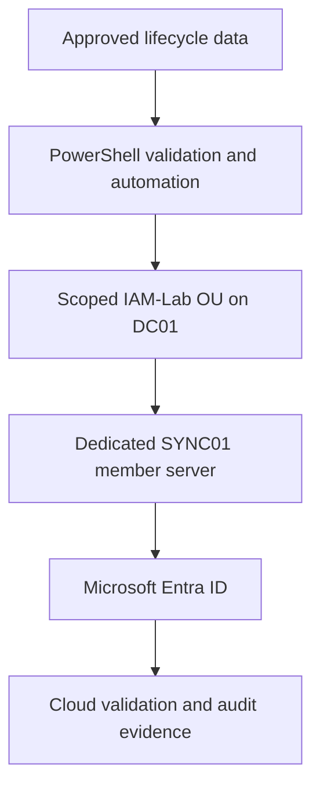

# Microsoft Hybrid Identity Lifecycle Automation

Enterprise-style identity lifecycle engineering laboratory integrating an
existing Windows Server Active Directory domain with Microsoft Entra ID through
a separately administered synchronization server.

The project implements controlled joiner, mover and leaver workflows with
PowerShell, scoped hybrid synchronization, direct state validation, audit
evidence and recoverable change controls.

| Project attribute | Current value |
|---|---|
| Status | In progress — Milestone 1 validated |
| Active Directory domain | `corporate.test` |
| Authoritative identity source | Active Directory Domain Services |
| Existing domain controller | `DC01.corporate.test` |
| Planned synchronization server | `SYNC01.corporate.test` |
| Planned IAM identities | 30 controlled users |
| Planned departments | Finance, Human Resources, Information Technology, Sales, Operations and Contractors |
| Synchronization boundary | Dedicated IAM organisational-unit scope only |
| Recovery checkpoint | `IAM-P1-M01-PreChange-Validated-State` |

## Why this project exists

Manual identity administration creates inconsistent accounts, excessive group
membership, slow onboarding and offboarding, and weak evidence of what changed.
The objective of this project is to demonstrate how an IAM engineer can turn an
approved identity record into a controlled and auditable lifecycle.

The implementation is designed to answer practical questions:

- How should new identities be validated before provisioning?
- How can naming, attributes, organisational-unit placement and group access be
  applied consistently?
- How should obsolete access be removed when an employee changes role?
- What proves that a leaver can no longer authenticate or retain access?
- How can on-premises identities be synchronized without exposing the entire
  existing directory?
- Which evidence proves the requested state and the effective final state?
- How can a failed or incorrect lifecycle operation be investigated and safely
  recovered?

## Planned architecture

`DC01` remains the domain controller and authoritative directory source.
`SYNC01` will be built as a separate domain-joined Windows member server. It
will not host another forest and will not be promoted to a domain controller.
Only the isolated IAM scope will be eligible for synchronization.

## Current validated outcomes

Milestone 1 established a trusted and recoverable starting point:

- Confirmed `DC01` and `corporate.test` were healthy.
- Preserved the 50 permanent identities created for the earlier SIEM project.
- Confirmed all five disposable identity-threat-detection accounts remained
  disabled.
- Confirmed the synthetic high-value group contained zero members.
- Validated all required Active Directory and Azure Arc services.
- Validated the Azure Monitor Agent process after bounded startup polling.
- Proved that no `IAM-Lab` OU or `SYNC01` computer object existed.
- Created the powered-off VMware recovery checkpoint
  `IAM-P1-M01-PreChange-Validated-State`.
- Produced a reusable read-only baseline validation script.

See the complete [baseline and recovery checkpoint record](docs/Baseline-and-Recovery-Checkpoint.md).

## Evidence highlights

### Pre-change recovery checkpoint

### Post-checkpoint baseline

## Lifecycle scope

The completed project will implement three controlled workflows.

### Joiner

- Validate approved input data.
- Create a uniquely named identity.
- Apply required attributes and organisational-unit placement.
- Assign baseline and role-based group access.
- Enforce the approved initial credential controls.
- Record the operation and validate the effective account state.

### Mover

- Capture the identity's current attributes and access.
- Remove obsolete access before granting the new role.
- Update department, title, manager and directory placement where applicable.
- Add only the groups required by the destination role.
- Produce a before-and-after access comparison.

### Leaver

- Disable the account.
- Remove access-group memberships.
- Move the object into the controlled leaver scope.
- Record the operation and final state.
- Prove that access has been removed.
- Demonstrate a governed recovery path for an incorrect offboarding action.

## Implementation milestones

| Milestone | Principal outcome | Status |
|---:|---|---|
| 0 | Local project structure and private GitHub repository | Complete |
| 1 | Existing-environment baseline and powered-off recovery checkpoint | Complete |
| 2 | Dedicated synchronization-server and network foundation | Planned |
| 3 | Isolated IAM directory structure, groups and controlled identity data | Planned |
| 4 | Joiner provisioning automation and validation | Planned |
| 5 | Mover access-transition automation and validation | Planned |
| 6 | Leaver containment, recovery and validation | Planned |
| 7 | Scoped Microsoft Entra synchronization and cloud-state validation | Planned |
| 8 | Integrated lifecycle testing and portfolio quality review | Planned |

Milestone boundaries may be refined when a technical dependency requires a
different validation order, but the project scope will remain unchanged.

## Current reusable artifacts

### PowerShell

- [Validate the pre-deployment environment](scripts/Test-IAMProject1Baseline.ps1)

### Documentation

- [Baseline and recovery checkpoint](docs/Baseline-and-Recovery-Checkpoint.md)

## Repository contents

| Path | Purpose |
|---|---|
| `architecture/` | Hybrid identity design, data flow, trust boundaries and source-of-authority decisions |
| `data/` | Sanitised lifecycle input and controlled identity data |
| `docs/` | Milestone implementation, validation and troubleshooting records |
| `queries/` | Reusable directory or Microsoft Graph query artifacts where required |
| `runbooks/` | Joiner, mover, leaver, recovery and operational procedures |
| `screenshots/` | Numbered milestone evidence captured only after validation |
| `scripts/` | PowerShell provisioning, transition, recovery and validation automation |
| `lessons-learned.md` | Final engineering decisions, failures, corrections and production improvements |

The local `temporary/` directory is used to assemble validated GitHub upload
packages and is not part of the public repository.

## Security and testing controls

- No passwords, access tokens or authentication secrets are stored in the
  repository.
- Existing SOC identities are preserved rather than repurposed.
- New IAM objects use a separately scoped directory structure.
- The synchronization role is separated from the domain-controller role.
- Only approved milestone files are copied into clean upload packages.
- Screenshots are reviewed for personal and cloud-environment identifiers.
- Destructive lifecycle tests use controlled identities and explicit recovery
  validation.
- Script output is not accepted as proof without direct state verification.

## Current limitations

- The current laboratory has one domain controller.
- The synchronization server has not yet been deployed.
- Microsoft Entra synchronization has not yet been enabled.
- Joiner, mover and leaver identities have not yet been created.
- VMware checkpoints provide laboratory rollback, not production backup or
  cross-platform recovery.
- The final synchronization technology will be selected only after its feature
  requirements are validated against the project scenarios.

These are current milestone boundaries, not claims of completed capability.
Later documentation will retain the distinction between laboratory
implementation and production design.

## Evidence standard

Every milestone follows the same controlled sequence:

1. Perform one bounded technical change.
2. Validate the effective state.
3. Capture sanitised evidence only after validation.
4. Produce reusable documentation and automation.
5. Verify file inventory, hashes, syntax, links and privacy.
6. Assemble only approved files in a clean temporary upload folder.
7. Upload one milestone package and inspect the rendered GitHub result.

This repository documents a hands-on laboratory implementation. It does not
represent production employment experience or a script that should be executed
unchanged in a production environment.
