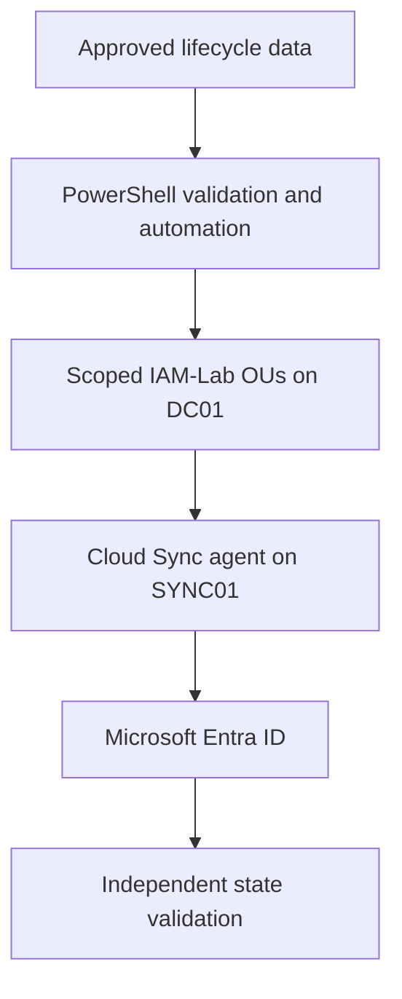

# Microsoft Hybrid Identity Lifecycle Automation

Enterprise-style identity lifecycle engineering laboratory integrating Windows
Server Active Directory with Microsoft Entra ID through a dedicated Microsoft
Entra Cloud Sync server.

The project implements controlled Joiner, Mover and Leaver workflows with
PowerShell, approval-driven input, least-privilege group management, correlated
auditing, recovery controls and independent validation in both directories.

## Executive overview

| Executive question | Answer |
|---|---|
| **Business problem** | Manual identity administration can create inconsistent accounts, delayed onboarding and offboarding, excessive access and weak evidence of what changed. |
| **Environment and scope** | A controlled hybrid laboratory using AD DS on `DC01`, a dedicated Microsoft Entra Cloud Sync agent on `SYNC01`, and only the protected `IAM-Lab` organisational units. |
| **Five implemented controls** | Approved-input validation; disabled Joiner staging; remove-before-add Mover access; disable-before-remove Leaver containment; correlated audit and independent state validation. |
| **Strongest technical result** | `IAM3001` completed an approved Finance Joiner, least-privilege IT Mover and retained access-free Leaver transition across AD DS and Microsoft Entra ID. |
| **Final assurance outcome** | 32 ordered lifecycle audit events, zero failed events, zero residual IAM3001 memberships and a retained disabled identity validated in both directories. |

| Project attribute | Validated state |
|---|---|
| Status | Complete — Milestone 8 validated |
| Active Directory domain | `corporate.test` |
| Authoritative identity source | Active Directory Domain Services on `DC01` |
| Synchronization server | `SYNC01.corporate.test` — dedicated member server |
| Synchronization technology | Microsoft Entra Cloud Sync |
| Synchronization boundary | Protected `IAM-Lab` organisational units only |
| Governed population | 34 retained synthetic IAM users and 15 IAM security groups |
| Final enabled state | 30 enabled and four disabled identities |
| Integrated test identity | `IAM3001` — validated through Joiner, Mover and Leaver states |
| Final IAM3001 state | Retained, disabled, access-free and synchronized to Microsoft Entra ID |

## Project objective

Manual identity administration creates inconsistent accounts, excessive access,
slow onboarding and offboarding, and weak evidence of what changed. This project
demonstrates a controlled hybrid identity lifecycle in which:

- approved data is validated before any directory write;
- accounts are created in a disabled staging state;
- access is derived from workforce and role requirements;
- obsolete access is removed before new access is granted;
- leavers are disabled before memberships are removed;
- every transaction receives a correlated audit trail;
- idempotent replay and governed recovery are tested; and
- effective state is independently verified in AD DS and Microsoft Entra ID.

## Architecture

`DC01` remains the domain controller and authoritative identity source.
`SYNC01` is a separate Windows Server 2022 member server running the Microsoft
Entra provisioning agent. Only the protected `IAM-Lab` user and group OUs are
eligible for synchronization, preventing the earlier SOC and IDTR populations
from entering the tenant.

The architectural decision is documented in
[Cloud Sync Architecture Decision](architecture/Cloud-Sync-Architecture-Decision.md).

## Validated results

| Control | Result |
|---|---:|
| Controlled IAM users retained | 34 |
| Enabled controlled users | 30 |
| Disabled controlled users | 4 |
| Employee identities | 29 |
| Contractor identities | 5 |
| IAM security groups | 15 |
| Final direct IAM memberships | 140 |
| Users retained in the protected Leavers OU | 4 |
| Integrated lifecycle audit files | 3 |
| Integrated lifecycle audit events | 32 |
| Failed integrated audit events | 0 |
| IAM3001 final direct group memberships | 0 |
| PowerShell parse failures | 0 |

The final validator confirmed the approved dataset hash, all three correlated
lifecycle audits, the retained and disabled IAM3001 object, preserved Mover
attributes, protected Leavers OU placement, zero direct access and the expected
controlled population totals.

## Integrated Joiner–Mover–Leaver scenario

The final end-to-end test used one approved synthetic identity: `IAM3001`, Nora
Whitfield.

| Stage | Controlled action | Independently validated outcome |
|---|---|---|
| Joiner | Create in Finance, assign manager IAM1001 and five approved groups | Enabled Finance employee synchronized to Entra ID with five AD-sourced memberships |
| Mover | Remove two obsolete Finance groups, move to Information Technology, assign manager IAM1201 and two IT groups | Enabled IT employee with five correct memberships and no residual Finance access |
| Leaver | Disable, remove five memberships and move the retained object to the protected Leavers OU | Disabled synchronized identity retained in both directories with zero group memberships |

The three lifecycle executions produced 32 ordered audit events with no failed
events, correlation mismatches, secret columns or sensitive-value findings.

Full implementation and recovery detail:

- [Integrated Hybrid Identity Lifecycle Validation](docs/Integrated-Hybrid-Identity-Lifecycle-Validation.md)
- [Integrated Hybrid Lifecycle Operations Runbook](runbooks/04-integrated-hybrid-lifecycle-test.md)
- [Project Lessons Learned](lessons-learned.md)

## Selected evidence

The README intentionally presents only representative evidence. The complete
76-image audit trail remains available in the [`screenshots`](screenshots/)
directory and is explained in the linked milestone documents.

### Trusted infrastructure foundation

The initial validation preserved the existing environment before change.

The dedicated synchronization server was then validated as a domain-joined
member server rather than a domain controller.

### Controlled identity foundation

A protected 16-OU hierarchy isolated the IAM identities, groups, infrastructure
and Leavers scope from previous lab populations.

### Lifecycle automation

Approved Joiner requests were provisioned through disabled staging, governed
configuration and post-change validation.

Mover execution removed obsolete access before granting destination-role access.

Leaver execution disabled identities before access removal and retained them in
the protected Leavers OU.

### Scoped Microsoft Entra Cloud Sync

The configuration synchronized only the approved user and group OUs.

Independent Microsoft Graph validation confirmed the complete scoped cloud
population and zero unexpected synchronized identities.

### Integrated lifecycle proof

IAM3001 received the five approved Finance memberships after the Joiner stage.

The Mover stage replaced Finance access with the approved Information Technology
access while preserving baseline workforce memberships.

The Leaver stage removed every synchronized membership.

The final read-only validation confirmed the lifecycle audit trail and effective
Active Directory state.

## Implementation milestones

| Milestone | Principal outcome | Status |
|---:|---|---|
| 0 | Repository and controlled local project structure | Complete |
| 1 | Existing-environment baseline and recovery checkpoint | Complete |
| 2 | Dedicated synchronization-server foundation | Complete |
| 3 | Protected IAM directory, groups and controlled workforce data | Complete |
| 4 | Joiner provisioning, auditing and idempotent replay | Complete |
| 5 | Least-privilege Mover transition and validation | Complete |
| 6 | Leaver containment, recovery and validation | Complete |
| 7 | Scoped Microsoft Entra Cloud Sync and cloud-state validation | Complete |
| 8 | Integrated hybrid lifecycle test and final project validation | Complete |

## Technical documentation

| Area | Design and validation record | Operations runbook |
|---|---|---|
| Baseline and recovery | [Baseline and Recovery Checkpoint](docs/Baseline-and-Recovery-Checkpoint.md) | — |
| Synchronization server | [Dedicated Sync Server Foundation](docs/Dedicated-Sync-Server-Foundation.md) | — |
| Identity foundation | [Controlled Identity Foundation](docs/Controlled-Identity-Foundation.md) | — |
| Joiner | [Controlled Joiner Provisioning Automation](docs/Controlled-Joiner-Provisioning-Automation.md) | [Joiner Runbook](runbooks/01-controlled-joiner-provisioning.md) |
| Mover | [Controlled Mover Access Transition Automation](docs/Controlled-Mover-Access-Transition-Automation.md) | [Mover Runbook](runbooks/02-controlled-mover-access-transition.md) |
| Leaver | [Controlled Leaver Containment and Recovery](docs/Controlled-Leaver-Containment-and-Recovery.md) | [Leaver Runbook](runbooks/03-controlled-leaver-containment-and-recovery.md) |
| Cloud Sync | [Scoped Microsoft Entra Cloud Sync](docs/Scoped-Microsoft-Entra-Cloud-Sync.md) | — |
| Integrated lifecycle | [Integrated Hybrid Identity Lifecycle Validation](docs/Integrated-Hybrid-Identity-Lifecycle-Validation.md) | [Integrated Lifecycle Runbook](runbooks/04-integrated-hybrid-lifecycle-test.md) |
| Testing and assurance | [Testing Strategy](docs/Testing-Strategy.md) | Automated repository checks in [GitHub Actions](.github/workflows/powershell-validation.yml) |
| Configuration and permissions | [Configuration and Permissions Model](docs/Configuration-and-Permissions-Model.md) | — |

## Reusable automation and data

The repository contains 25 PowerShell scripts covering environment validation,
directory construction, controlled provisioning, Joiner–Mover–Leaver execution,
recovery, auditing and Microsoft Graph state validation. The final integrated
workflow is represented by:

- [approved lifecycle record](data/iam-project1-integrated-lifecycle-test.csv);
- [integrated preflight validator](scripts/Test-IAMProject1IntegratedLifecyclePreflight.ps1);
- [Joiner executor](scripts/Invoke-IAMProject1IntegratedJoiner.ps1) and
  [cloud validator](scripts/Test-IAMProject1IntegratedJoinerCloudState.ps1);
- [Mover executor](scripts/Invoke-IAMProject1IntegratedMover.ps1),
  [AD validator](scripts/Test-IAMProject1IntegratedMoverState.ps1) and
  [cloud validator](scripts/Test-IAMProject1IntegratedMoverCloudState.ps1);
- [Leaver executor](scripts/Invoke-IAMProject1IntegratedLeaver.ps1),
  [AD validator](scripts/Test-IAMProject1IntegratedLeaverState.ps1) and
  [cloud validator](scripts/Test-IAMProject1IntegratedLeaverCloudState.ps1); and
- [final integrated lifecycle validator](scripts/Test-IAMProject1IntegratedLifecycleState.ps1).

## Security and engineering controls

- No passwords, access tokens or authentication secrets are stored in the
  repository.
- Random initial passwords are generated in memory and are never displayed,
  logged or exported.
- Every write-capable workflow performs approval, schema, hash, collision, OU,
  manager and group validation before change.
- Obsolete access is removed before destination access is granted.
- Leaver accounts are disabled before membership removal.
- Accounts are retained rather than deleted, supporting investigation and
  governed recovery.
- Idempotent replay produces explicit no-change decisions.
- Existing SOC and IDTR populations remain outside the synchronization scope.
- Scripts, Markdown links, image inventory and evidence privacy are validated
  before publication.
- GitHub Actions performs cross-platform parser, repository-contract and static
  analysis checks without connecting to the laboratory directory.

## Repository structure

| Path | Purpose |
|---|---|
| `architecture/` | Architecture decisions and source-of-authority boundaries |
| `data/` | Sanitised identity requests, manifests and audit records |
| `docs/` | Detailed milestone implementation and validation records |
| `runbooks/` | Operational execution, recovery and verification procedures |
| `screenshots/` | Complete numbered evidence archive |
| `scripts/` | Provisioning, transition, recovery and validation automation |
| `tests/` | Safe Pester tests for syntax, approved data and repository contracts |
| `.github/workflows/` | Automated PowerShell parsing, Pester and PSScriptAnalyzer checks |
| `lessons-learned.md` | Engineering decisions, failures, corrections and production improvements |

The local `temporary/` directory is used only to assemble validated upload
packages and is intentionally excluded from the public repository.

## Laboratory limitations

- The laboratory uses one domain controller and one Cloud Sync agent.
- VMware checkpoints provide laboratory rollback, not production backup.
- Cloud Sync does not provide device synchronization or Hybrid Microsoft Entra
  Join, neither of which is required by the approved project scope.
- Production deployment would require additional agent resilience, enterprise
  monitoring, formal approval integration and managed credential delivery.

This repository documents a hands-on laboratory implementation. It does not
represent production employment experience or a script that should be executed
unchanged in a production environment.
