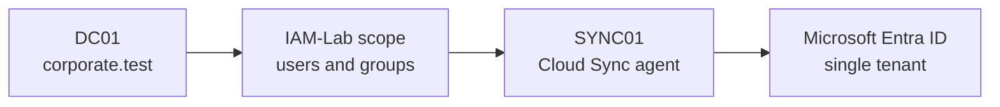

# Microsoft Entra Cloud Sync Architecture Decision

## Decision record

| Attribute | Value |
|---|---|
| Project | Microsoft Hybrid Identity Lifecycle Automation |
| Milestone | 2 — Dedicated synchronization-server foundation |
| Status | Accepted |
| Decision date | 30 August 2026 |
| On-premises forest | `corporate.test` |
| Authoritative identity source | Active Directory Domain Services on `DC01` |
| Synchronization host | `SYNC01.corporate.test` |
| Selected technology | Microsoft Entra Cloud Sync |

## Context

The project needs to synchronize a deliberately isolated set of approximately
30 lifecycle-test identities and selected security groups from the existing
`corporate.test` forest to one Microsoft Entra tenant. The 50 permanent users
from the earlier SIEM project must remain outside the synchronization boundary.

The laboratory host has 16 GB of physical memory and must operate the existing
4 GB domain controller alongside a dedicated synchronization server. The
project requires user, group, attribute and password-hash synchronization. It
does not require device synchronization, Hybrid Microsoft Entra Join,
Pass-through Authentication configuration, Active Directory Federation
Services integration or Exchange hybrid configuration.

## Decision

Microsoft Entra Cloud Sync will run through the Microsoft Entra provisioning
agent on the dedicated `SYNC01` member server.

The implementation will use these boundaries:

- Active Directory remains the authoritative source for synchronized users.
- Only approved objects in the isolated `IAM-Lab` scope are eligible for
  synchronization.
- `SYNC01` remains a member server and will not be promoted to a domain
  controller.
- Password hash synchronization will be enabled when the Cloud Sync
  configuration is created.
- The agent server will not host unrelated applications or laboratory roles.
- The 50 permanent SOC identities and five disabled identity-threat-detection
  users remain outside the approved synchronization scope.

## Why Cloud Sync was selected

| Criterion | Cloud Sync assessment |
|---|---|
| Required identity objects | Supports the required user and group synchronization |
| Password hash synchronization | Supported |
| Directory topology | Supports the required single-forest, single-tenant topology |
| Resource fit | Minimum 4 GB server memory fits the dedicated 4 GB `SYNC01` VM |
| Separation of duties | Runs on a dedicated domain-joined member server |
| Scoped pilot | Supports a deliberately limited object scope |
| Device synchronization | Not supported, but not required by this project |
| High availability | Multiple active agents are supported; one agent is sufficient only for this laboratory |

Microsoft Entra Connect Sync was considered but not selected. For fewer than
10,000 directory objects, Microsoft documents a 6 GB memory and 70 GB disk
baseline for Connect Sync. It would consume more of the 16 GB laboratory host
without adding a capability required by the approved Project 1 scenarios.

## Security consequences

The provisioning agent can affect the identity control plane. Microsoft
therefore identifies the agent host as a Control Plane, formerly Tier 0, asset.
For this laboratory:

- Administrative access to `SYNC01` is restricted to controlled administrator
  accounts.
- The server uses Active Directory DNS and the domain time hierarchy.
- VMware host-to-guest clipboard functionality is enabled only while required
  for controlled build operations and can be disabled during final hardening.
- Repository files do not contain passwords, tenant secrets, tokens or
  reusable credentials.
- Powered-off paired checkpoints provide a laboratory recovery path before the
  provisioning agent changes the environment.

A production deployment would additionally use formal privileged-access
workstations, enterprise patching and monitoring, tested backup, and multiple
active agents when availability requirements justify them. Microsoft
recommends three active agents for high availability; that recommendation is
documented here but is intentionally outside this single-host laboratory.

## Consequences and limitations

This decision provides every synchronization capability required by Project 1
while keeping the infrastructure realistic and supportable on the available
host. It also means the project must not claim to demonstrate device
synchronization, Hybrid Microsoft Entra Join, or a highly available production
agent group.

If a later project explicitly requires hybrid device identity, the design must
be reassessed. That would be a new requirement and might require Microsoft
Entra Connect Sync, an endpoint-management platform and additional laboratory
memory. It is not a hidden dependency of the current five-project IAM plan.

## References

- [Prerequisites for Microsoft Entra Cloud Sync](https://learn.microsoft.com/en-us/entra/identity/hybrid/cloud-sync/how-to-prerequisites)
- [Microsoft Entra Cloud Sync supported topologies](https://learn.microsoft.com/en-us/entra/identity/hybrid/cloud-sync/plan-cloud-sync-topologies)
- [What is Microsoft Entra Cloud Sync?](https://learn.microsoft.com/en-us/entra/identity/hybrid/cloud-sync/what-is-cloud-sync)
- [Microsoft Entra Cloud Sync deep dive](https://learn.microsoft.com/en-us/entra/identity/hybrid/cloud-sync/concept-how-it-works)
- [Microsoft Entra Connect and Cloud Sync decision guide](https://learn.microsoft.com/en-us/entra/identity/hybrid/cloud-sync/connect-to-cloud-sync-decision-guide)
- [Microsoft Entra Connect installation prerequisites](https://learn.microsoft.com/en-us/entra/identity/hybrid/connect/how-to-connect-install-prerequisites)

