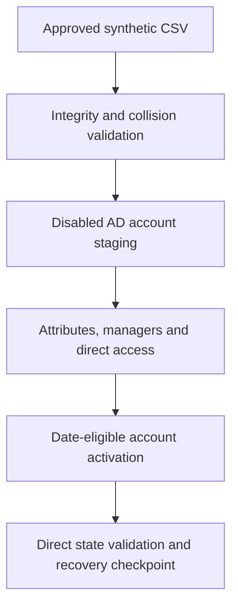

# Controlled Identity Foundation

## Purpose

Milestone 3 creates the isolated on-premises identity population that later
joiner, mover, leaver and Microsoft Entra Cloud Sync work will control. Active
Directory Domain Services on `DC01.corporate.test` remains authoritative.

The implementation deliberately separates the new IAM objects from the 50
permanent users and five disabled identity-threat-detection users that already
exist in the same forest. No existing identity was repurposed.

| Attribute | Validated value |
|---|---|
| Milestone | 3 — Isolated IAM directory structure, groups and controlled identity data |
| Implementation date | 3 September 2026 |
| AD DS namespace | `corporate.test` |
| Entra-compatible UPN suffix | `danielcloudlaboutlook258.onmicrosoft.com` |
| Protected organisational units | 16 |
| Controlled users | 30 active synthetic identities |
| Employees | 25 |
| Contractors | 5 |
| Global Security groups | 15 |
| Manager relationships | 24 |
| Direct IAM group memberships | 140 |
| Leaver objects | 0 at baseline |

## Controlled provisioning sequence



The sequence separates object creation from activation. Accounts were first
created disabled, then checked for correct attributes, organisational-unit
placement, manager relationships and group access. Only records marked
`Active` whose start date had arrived and whose end date had not passed were
enabled.

## Directory boundary

The protected `IAM-Lab` hierarchy is the future Cloud Sync selection boundary.
Microsoft Entra synchronization is not enabled in this milestone.

```text
IAM-Lab
├── Users
│   ├── Employees
│   │   ├── Finance
│   │   ├── Human Resources
│   │   ├── Information Technology
│   │   ├── Sales
│   │   └── Operations
│   ├── Contractors
│   └── Leavers
├── Groups
│   ├── Baseline
│   ├── Departments
│   └── Access
└── Infrastructure
    └── Servers
```

Every OU is protected from accidental deletion. `SYNC01` remains the existing
domain-joined member server; only its computer account was moved into
`IAM-Lab/Infrastructure/Servers`. This organisational change did not rename the
server, alter its network configuration or recreate its machine trust.


## UPN design

The AD DS DNS namespace remains `corporate.test`. Because that laboratory
suffix is not the verified Entra tenant domain, the forest received this
alternative UPN suffix:

```text
danielcloudlaboutlook258.onmicrosoft.com
```

Controlled users therefore retain an AD DS object in `corporate.test` while
using an Entra-compatible sign-in name. Existing SOC and IDTR accounts retain
their original UPNs.

## Security-group model

All 15 groups are Global Security groups. Direct user membership was selected
to make each entitlement visible and independently verifiable before cloud
synchronization.

| Group class | Groups | Membership rule |
|---|---:|---|
| Workforce baseline | 3 | All workforce, employees or contractors |
| Department | 5 | One departmental group for each employee department |
| Access | 7 | Microsoft 365 baseline plus one approved business-system access group |

Each employee receives five IAM memberships: all workforce, all employees,
department, Microsoft 365 baseline and departmental application access. Each
contractor receives three: all workforce, all contractors and the restricted
contractor portal. The resulting effective baseline contains 140 direct
user-to-group relationships.

## Controlled dataset

The authoritative source file is
[`iam-project1-controlled-users.csv`](../data/iam-project1-controlled-users.csv).
It contains 30 synthetic records and no password, secret or credential column.

| Field | Purpose |
|---|---|
| `EmployeeID` | Stable identity correlation key |
| `SamAccountName` | Unique AD DS logon identifier |
| `UserPrincipalName` | Entra-compatible sign-in identifier |
| `WorkerType` | Employee or contractor classification |
| `ManagerEmployeeID` | Manager relationship using a stable source identifier |
| `StartDate` and `EndDate` | Activation and time-bound contractor controls |
| `TargetOU` | Approved directory placement |
| Group columns | Expected baseline, department and resource access |
| `LifecycleStatus` | Source approval state used by activation logic |

The validated SHA-256 digest is:

```text
153FCF70CA0B8C1B366767BB0F61AEF7E65EF074AD2FA29726C3AF1A07EC9641
```

## Collision control

Pre-provisioning validation detected three `sAMAccountName` values already
used by permanent SOC identities. The existing accounts were not changed.
Only the proposed IAM identifiers were remediated by appending their stable
employee-number component:

| Employee ID | Rejected value | Approved value |
|---|---|---|
| `IAM1002` | `noah.bennett` | `noah.bennett1002` |
| `IAM1201` | `ava.mitchell` | `ava.mitchell1201` |
| `IAM1303` | `ella.hughes` | `ella.hughes1303` |

This preserved existing identities and made the exception deterministic and
auditable rather than relying on an undocumented manual rename.

## Initial credential control

Each newly created account received a separate 24-character password generated
from a cryptographic random-number generator. Plain-text values existed only
transiently in process memory while being converted to `SecureString`; they
were never displayed, logged, written to the dataset or committed to the
repository.

These unknown initial values are suitable for establishing password hashes and
preventing unauthorized interactive use. A later controlled test that requires
interactive sign-in must reset only the selected synthetic account through a
secure prompt. This laboratory mechanism is not a substitute for an enterprise
credential-delivery or passwordless onboarding process.

## Representative effective-state evidence

The Finance OU contains five enabled identities after the staged activation.


`IAM1002` demonstrates the collision-remediated username, Entra-compatible UPN,
manager relationship and exact five-group access model.


## Validation contract

The reusable validator performs read-only checks against the dataset and the
effective directory state. It verifies:

1. The source file hash and absence of secret-bearing columns.
2. All 16 expected OUs and accidental-deletion protection.
3. Exactly 15 expected Global Security groups and their member counts.
4. Exactly 30 controlled users with correct identifiers, attributes and OUs.
5. Twenty-four manager relationships and 140 exact direct memberships.
6. Five contractor expiration controls and an empty leaver OU.
7. The Entra-compatible UPN suffix and `SYNC01` computer-account placement.
8. Seven required `DC01` services and the `MonAgentCore.exe` process.
9. Preservation of 50 permanent users, five disabled IDTR users and the empty
   synthetic high-value group.

An early validation revision looked for a Windows service named
`MonAgentCore`. Diagnostic evidence showed that `MonAgentCore` was the running
process name in this installation. The final validator therefore uses a
process-based check, consistent with the earlier validated SOC baseline.


## Recovery checkpoint

`DC01` was shut down cleanly before the powered-off VMware snapshot was taken.

| Property | Value |
|---|---|
| Snapshot | `IAM-P1-M03-Controlled-Identity-Foundation` |
| Created | 3 September 2026 |
| VM state | Powered off |
| Scope | AD DS identity foundation after comprehensive validation |

`SYNC01` did not receive another snapshot because its guest disk was unchanged
throughout Milestone 3. The `SYNC01` object placement was an AD DS change stored
on `DC01`. The earlier paired Milestone 2 snapshots remain the recovery point
for the member server's disk and matching pre-agent machine relationship.


After the snapshot, `DC01` restarted successfully with every required service,
the Azure Monitor Agent process and the complete controlled identity state
healthy.


VMware snapshots are laboratory rollback points, not production AD DS
system-state backups or an enterprise disaster-recovery design.

## Production improvements

- Integrate an authoritative HR source instead of a repository CSV.
- Separate request, approval and execution identities.
- Store credentials in an approved vault and deliver onboarding credentials
  through a protected channel, or use passwordless onboarding.
- Add change tickets, immutable audit records and alerting for failed or
  partially completed operations.
- Use delegated administration and a dedicated automation identity rather than
  an interactive domain administrator.
- Test AD DS system-state backup and authoritative/non-authoritative recovery.
- Deploy additional Cloud Sync agents when production availability requires
  them.

## References

- [New-ADOrganizationalUnit](https://learn.microsoft.com/en-us/powershell/module/activedirectory/new-adorganizationalunit?view=windowsserver2025-ps)
- [New-ADGroup](https://learn.microsoft.com/en-us/powershell/module/activedirectory/new-adgroup?view=windowsserver2025-ps)
- [Add-ADGroupMember](https://learn.microsoft.com/en-us/powershell/module/activedirectory/add-adgroupmember?view=windowsserver2025-ps)
- [New-ADUser](https://learn.microsoft.com/en-us/powershell/module/activedirectory/new-aduser?view=windowsserver2025-ps)
- [Set-ADForest](https://learn.microsoft.com/en-us/powershell/module/activedirectory/set-adforest?view=windowsserver2025-ps)
- [Manage custom domain names in Microsoft Entra ID](https://learn.microsoft.com/en-us/entra/identity/users/domains-manage)
- [Microsoft Entra Cloud Sync configuration](https://learn.microsoft.com/en-us/entra/identity/hybrid/cloud-sync/how-to-configure)
- [Prerequisites for Microsoft Entra Cloud Sync](https://learn.microsoft.com/en-us/entra/identity/hybrid/cloud-sync/how-to-prerequisites)
