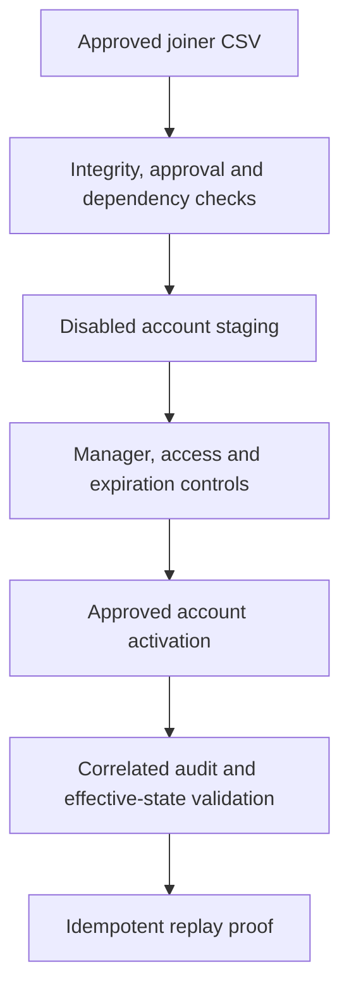

# Controlled Joiner Provisioning Automation

## Purpose

Milestone 4 converts three approved lifecycle records into governed Active
Directory identities. The workflow uses `DC01.corporate.test` as the
authoritative directory and preserves the isolated `IAM-Lab` boundary created
in Milestone 3. Microsoft Entra Cloud Sync remains intentionally disabled until
the later scoped-synchronization milestone.

| Attribute | Validated value |
|---|---|
| Milestone | 4 — Joiner provisioning automation and validation |
| Implementation date | 4 September 2026 |
| Approved requests | 3 |
| Employee joiners | 2 |
| Contractor joiners | 1 |
| Manager assignments added | 3 |
| Direct IAM memberships added | 13 |
| Controlled users after provisioning | 33 enabled identities |
| Manager relationships after provisioning | 27 |
| Direct IAM memberships after provisioning | 153 |
| Initial audit events | 25 |
| Idempotent replay decisions | 3 no-change results |

## Control flow



The process completes every dependency and collision check before the first
directory write. Each new account is staged disabled. Activation occurs only
after its manager, exact approved groups and any required contractor expiration
have been applied.

## Pre-change validation

The Milestone 3 foundation was validated before creating the request file. The
preflight confirmed 30 enabled controlled users, 24 manager relationships, 140
direct IAM memberships, 15 approved groups, no leaver objects and no proposed
joiner collisions. It also preserved the existing 50 permanent SOC users, five
disabled IDTR users, empty high-value test group, required services and Azure
Monitor Agent process.


## Approved request dataset

The authoritative input is
[`iam-project1-joiner-requests.csv`](../data/iam-project1-joiner-requests.csv).
It contains 24 governance fields and no password, credential, token or secret
column.

| Request | Identity | Type | Manager | Approved access count |
|---|---|---|---|---:|
| `JNR-2026-0904-001` | Theo Lawson (`IAM2001`) | Employee — Information Technology | `IAM1201` | 5 |
| `JNR-2026-0904-002` | Isla Grant (`IAM2002`) | Employee — Human Resources | `IAM1101` | 5 |
| `JNR-2026-0904-003` | Mason Cole (`IAM2003`) | Contractor | `IAM1501` | 3 |

The validated dataset SHA-256 digest is:

```text
8685B8C4C99B68ED7B7EFAA888587FBDDBF0E94B48932922D130AEDD2B470CEE
```

The DC01 copy was accepted only after its digest matched the approved laptop
source and all three identifiers were proven collision-free.


## Provisioning transaction

[`Invoke-IAMProject1JoinerProvisioning.ps1`](../scripts/Invoke-IAMProject1JoinerProvisioning.ps1)
implements the reusable control sequence:

1. Verify execution host, domain, input file and exact SHA-256 digest.
2. Require three approved, active and date-eligible joiner records.
3. Resolve enabled managers, protected target OUs and Global Security groups.
4. reject ambiguous or conflicting Employee ID, `sAMAccountName` or UPN
   matches before any write.
5. Create new accounts disabled with cryptographically random 24-character
   passwords generated only in process memory.
6. Assign the approved manager, exact missing memberships and contractor
   expiration.
7. Enable the account after governance controls have succeeded.
8. Validate the complete directory and preserved-environment totals.
9. Export a correlated audit that contains no password value.

If an unexpected exception occurs after new accounts are created, the script
attempts to disable every identity created during that run and retains the
objects for investigation. It does not automatically delete identities or
remove access because those destructive actions require an explicit recovery
decision.

The first execution created three identities, assigned three managers and 13
memberships, applied one contractor expiration and enabled all three approved
accounts. The controlled state increased to 33 users and 153 direct IAM
memberships.


## Correlated transaction audit

The initial audit is
[`iam-project1-joiner-provisioning-audit.csv`](../data/iam-project1-joiner-provisioning-audit.csv).
All 25 records use correlation ID `M04-JOINER-20260904-182309`.

| Audit action | Events |
|---|---:|
| Preflight validation | 1 |
| Disabled account creation | 3 |
| Manager assignment | 3 |
| Approved membership addition | 13 |
| Contractor expiration | 1 |
| Account enablement | 3 |
| Post-provisioning validation | 1 |

Its validated SHA-256 digest is:

```text
F2905614937292210D87158A20046E67D6023E016A3CEF1025D187C6ED70E9A5
```

The audit validator confirmed zero failed events, no missing workflow stages,
one correlation ID, valid UTC timestamps and no exported secret-bearing field
or value pattern.


## Effective directory state

An LDAP search scoped to `IAM-Lab` confirmed the three request identities and
their request-specific descriptions.


Mason Cole demonstrates time-bound contractor governance. His approved contract
ends on 28 February 2027 and the AD account expiration is 1 March 2027 at
midnight. This preserves access through the complete approved final day and
blocks use afterward. His direct access is limited to workforce,
contractor-classification and contractor-portal groups.


## Idempotent replay

The same approved dataset was processed again. The automation matched each
request to the exact existing Employee ID, `sAMAccountName`, UPN and target OU.
Because every attribute and entitlement already matched the approved desired
state, the replay produced:

- zero created accounts;
- zero updated accounts;
- zero manager, membership, enablement or expiration changes;
- three explicit `IdempotentReplay` / `NoChange` audit decisions; and
- no password generation or reset for an existing identity.

The replay audit is
[`iam-project1-joiner-idempotent-replay-audit.csv`](../data/iam-project1-joiner-idempotent-replay-audit.csv)
with correlation ID `M04-JOINER-20260904-184532` and SHA-256 digest:

```text
C45F29E7B97F478F41E4E7FDE565DE97DBBE2BCDDA1F7BE9370F84ABB0C9569B
```


## Recovery checkpoint

`DC01` was shut down cleanly before the powered-off VMware snapshot was taken.

| Property | Value |
|---|---|
| Snapshot | `IAM-P1-M04-Controlled-Joiner-Automation` |
| Created | 4 September 2026 |
| VM state | Powered off |
| Scope | AD DS after joiner transaction, audit and idempotent replay validation |

`SYNC01` received no new snapshot because its guest disk was unchanged during
Milestone 4. The earlier dedicated-server checkpoint remains applicable until
the Cloud Sync agent installation milestone.


After restart, DC01 returned with seven required services, Azure Monitor Agent,
33 enabled controlled users, 27 manager relationships and 153 memberships. Both
audit files, the contractor expiration, SYNC01 placement and the earlier SOC and
IDTR boundaries remained valid.


VMware snapshots are laboratory recovery points. They are not a substitute for
AD DS system-state backup, immutable audit storage or production disaster
recovery.

## Security decisions

- The request dataset contains approval metadata but no credentials.
- Passwords are unique, cryptographically generated and never displayed,
  exported or written to an audit.
- Accounts are staged disabled and activated only after controls succeed.
- Employee ID is the stable correlation key; ambiguous identity matches stop
  the transaction.
- Unexpected IAM memberships stop replay rather than being removed silently.
- Contractor duration is enforced with an AD account-expiration control.
- Local CSV audits preserve evidence for the laboratory and are integrity
  checked before publication.
- No privileged role or administrative group is granted by the joiner process.

## Production improvements

- Replace the simulated HR CSV with an authoritative HR or API-driven source.
- Separate requester, approver and executor identities with delegated rights.
- Run automation through a managed service identity or protected automation
  account rather than an interactive domain administrator.
- Deliver initial credentials through a protected process or adopt passwordless
  onboarding and Temporary Access Pass where appropriate.
- Write audit events to an immutable, centrally monitored log platform.
- Add ticket identifiers, approval signatures, segregation-of-duties checks and
  alerts for partial or rejected transactions.
- Use production AD DS backup and tested restore procedures instead of VM
  snapshots.
- Add multiple Cloud Sync agents when production availability requirements
  justify high availability.

## References

- [Automate identity lifecycle management with Microsoft Entra ID Governance](https://learn.microsoft.com/en-us/entra/id-governance/scenarios/automate-identity-lifecycle)
- [New-ADUser](https://learn.microsoft.com/en-us/powershell/module/activedirectory/new-aduser?view=windowsserver2025-ps)
- [Set-ADUser](https://learn.microsoft.com/en-us/powershell/module/activedirectory/set-aduser?view=windowsserver2025-ps)
- [Add-ADGroupMember](https://learn.microsoft.com/en-us/powershell/module/activedirectory/add-adgroupmember?view=windowsserver2025-ps)
- [Enable-ADAccount](https://learn.microsoft.com/en-us/powershell/module/activedirectory/enable-adaccount?view=windowsserver2025-ps)
- [Set-ADAccountExpiration](https://learn.microsoft.com/en-us/powershell/module/activedirectory/set-adaccountexpiration?view=windowsserver2025-ps)
- [RandomNumberGenerator class](https://learn.microsoft.com/en-us/dotnet/api/system.security.cryptography.randomnumbergenerator)
- [about Try, Catch and Finally](https://learn.microsoft.com/en-us/powershell/module/microsoft.powershell.core/about/about_try_catch_finally)
