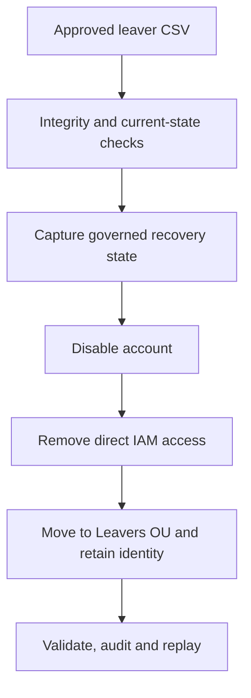

# Controlled Leaver Containment and Recovery

## Purpose

Milestone 6 implements a governed leaver workflow for approved workforce
departures. The workflow uses `DC01.corporate.test` as the authoritative
directory and limits every change to the protected `IAM-Lab` boundary.
Microsoft Entra Cloud Sync remains intentionally disabled until the scoped
synchronization milestone.

| Attribute | Validated value |
|---|---|
| Milestone | 6 — Leaver containment, recovery and validation |
| Implementation date | 5 September 2026 |
| Approved leaver requests | 3 employees |
| Accounts disabled | 3 |
| Direct IAM memberships removed | 15 |
| Objects moved to the protected Leavers OU | 3 |
| Accounts deleted | 0 |
| Passwords changed or exported | 0 |
| Recovery window | 30 days |
| Controlled users after containment | 33 retained identities; 30 enabled |
| Direct IAM memberships after containment | 140 |
| Idempotent replay decisions | 3 no-change results |
| Unresolved workflow failures | 0 |

## Control flow



The account is disabled before its memberships are removed. This sequence
contains authentication first, then removes authorization. The retained object,
unchanged identity attributes, manager reference and recovery manifest provide
an approved recovery path without making deletion part of routine offboarding.

## Pre-change validation

The Milestone 5 foundation was validated before the first leaver operation.
The preflight confirmed 33 enabled controlled users, 28 employees, five
contractors, 27 manager relationships and 155 direct IAM memberships. All
three candidates matched the approved mover state, and the protected Leavers
OU, seven required services, Azure Monitor Agent, `SYNC01` placement and
earlier SOC and IDTR controls remained healthy.

The approved plan contained three account disables, 15 direct-membership
removals and three OU moves. No directory write occurred during preflight.


## Approved leaver dataset

The authoritative input is
[`iam-project1-leaver-requests.csv`](../data/iam-project1-leaver-requests.csv).
It contains 30 governance fields and no password, credential, token or secret
column.

| Request | Synthetic identity | Source department | Direct memberships removed |
|---|---|---|---:|
| `LVR-2026-0904-001` | Theo Lawson (`IAM2001`) | Operations | 5 |
| `LVR-2026-0904-002` | Isla Grant (`IAM2002`) | Finance | 5 |
| `LVR-2026-0904-003` | Mason Cole (`IAM2003`) | Information Technology | 5 |

Every request requires account disablement, removal of all direct `GG_IAM_*`
memberships, placement in the protected Leavers OU, identity-attribute and
manager preservation, no deletion, recovery validation and a 30-day recovery
window.

The validated dataset SHA-256 digest is:

```text
96A488E3A26CA23F1AD7B9652DCDBD9D774D8EF4E201E8F677A4E0CCB6D482DE
```

The laptop copy passed schema, approval, control, uniqueness and secret-column
checks. The DC01 copy was accepted only after its digest matched the approved
source and the three retained accounts matched their declared source state.


## Fail-safe containment and controlled resume

[`Invoke-IAMProject1LeaverContainment.ps1`](../scripts/Invoke-IAMProject1LeaverContainment.ps1)
implements the reusable sequence:

1. Verify the execution host, domain, input file and exact SHA-256 digest.
2. Require exactly three approved requests and one matching retained account
   for each Employee ID.
3. Confirm each identity is wholly in its approved active, contained or safe
   partial state; reject an ambiguous state.
4. Confirm the protected Leavers OU and source-only IAM memberships.
5. Capture OU, enabled state, description, manager, memberships and account
   expiration in a recovery manifest before modifying the identity.
6. Disable the account before removing every direct `GG_IAM_*` membership.
7. Move the disabled object to the protected Leavers OU and apply its lifecycle
   description while preserving identity, job and manager attributes.
8. Validate the exact final state and export a correlated audit containing no
   passwords or other secrets.

The first execution, correlation ID `M06-LEAVER-20260904-235742`, safely
contained Theo Lawson and then stopped on a strict-mode scalar `.Count` error.
The 13-event interrupted audit records one failure after the three-record
recovery manifest had already been written. The account remained disabled,
access-free and retained; the other two accounts remained in their approved
source state.

The original script was preserved separately on DC01 for forensic comparison.
The public package excludes that broken pre-fix copy. Two scalar-sensitive
expressions were corrected by forcing array semantics with `@(...)`, and the
corrected script passed PowerShell parsing before execution.

The controlled resume, correlation ID `M06-LEAVER-20260904-235956`, detected
one already-contained identity and safely processed the remaining two. Its
23-event audit contains no failed event. Across the interrupted and resumed
operations, the evidence accounts for three disables, 15 removals, three OU
moves, three description updates and final-state coverage for all requests.


## Recovery and audit evidence

The authoritative pre-change recovery file is
[`iam-project1-leaver-recovery-manifest.csv`](../data/iam-project1-leaver-recovery-manifest.csv).
The combined trail is published as:

- [`iam-project1-leaver-interrupted-audit.csv`](../data/iam-project1-leaver-interrupted-audit.csv)
- [`iam-project1-leaver-resumed-audit.csv`](../data/iam-project1-leaver-resumed-audit.csv)
- [`iam-project1-leaver-recovery-manifest.csv`](../data/iam-project1-leaver-recovery-manifest.csv)

| Evidence | Records | SHA-256 |
|---|---:|---|
| Interrupted audit | 13 | `959B5696C823D9268D9BA660D846F05BB56290F31A46C8D467CF3974ED2CCB8C` |
| Authoritative recovery manifest | 3 | `96433B774255A7982D33917E38830B06F3F2D32AA62EC553330C10E843941880` |
| Resumed audit | 23 | `52469F2D0024A6071F0C85B57677C3E644032BC2E5A3FCB77DD8DD12EEF877AB` |

Validation confirmed consistent correlation within each file, valid UTC
timestamps, disable-before-removal ordering, no unexpected action, no secret
field or assignment pattern, and no unresolved failure.


Active Directory Users and Computers confirmed all three retained objects in
the Leavers OU with disabled status and the expected lifecycle descriptions.


Mason Cole provides representative object-level proof: the account remains
present, disabled and access-free; Employee ID, worker type, department, title
and manager are preserved; and its five original memberships are retained only
in the governed recovery evidence.


## Idempotent replay

The corrected containment script was executed again after all three identities
had reached the target state. Correlation ID `M06-LEAVER-20260905-001302`
produced three explicit `LeaverStateNoChange` decisions, zero modifications,
zero recovery records and zero failures.

The five-event replay audit is
[`iam-project1-leaver-idempotent-replay-audit.csv`](../data/iam-project1-leaver-idempotent-replay-audit.csv)
with SHA-256 digest:

```text
411BDD5A31222722918AF5B9C07F881B9A96D085ADDDA79082D7B8F88A1E0BBD
```


## Governed recovery and re-containment

[`Restore-IAMProject1Leaver.ps1`](../scripts/Restore-IAMProject1Leaver.ps1)
demonstrates approved recovery of one incorrectly contained identity. It
requires the authoritative request and recovery-manifest hashes, one approved
Employee ID, recovery approval `RCV-2026-0905-001`, the named approver and a
valid recovery window. It keeps the account disabled while restoring its OU,
description, expiration state and five approved memberships; only then does it
enable and validate the account.

Mason Cole was restored under correlation ID
`M06-RECOVERY-20260905-002158`. The 11-event audit records one OU restoration,
one description restoration, five group restorations, one enable operation,
recovered-state validation and post-recovery validation. It contains no failed
event, password change or deletion.

[`iam-project1-leaver-governed-recovery-audit.csv`](../data/iam-project1-leaver-governed-recovery-audit.csv)
has SHA-256 digest:

```text
84ADD11D93C6F99CCCE6E43119ABE7EEF080D2369A2BCBCF61E096E41BCEFE52
```


The approved leaver workflow was then run again. It recognized two unchanged
leavers and re-contained Mason under correlation ID
`M06-LEAVER-20260905-002356`. The operation produced a one-record recovery
manifest and a 14-event audit with one disable, five removals, one move, one
description update, two no-change decisions and no failures.

| Evidence | Records | SHA-256 |
|---|---:|---|
| Re-containment audit | 14 | `623945A0316794ECBBB9E5D5D0B6F0B5CC9D222FB60DE3806831F3E823934AEE` |
| Re-containment recovery manifest | 1 | `B86606AFD280F570C9CDC73C6C0006C223B2AF80E321C611C55AC52656F18E51` |


## Comprehensive validation

The read-only state validator checks all published evidence hashes and schemas,
the corrected scripts, the complete audit trail and the effective directory
state. It confirmed:

- 33 retained controlled identities, 30 enabled accounts and 140 direct IAM
  memberships;
- three approved leavers, zero enabled leavers and zero direct IAM memberships
  on leaver objects;
- 16 protected OUs and 15 Global Security groups;
- a recovered interruption and three replay no-change decisions across 66
  published Milestone 6 audit events;
- zero unresolved audit failures, hash mismatches, parse errors or exported
  secrets; and
- preserved `SYNC01` placement, seven required services, Azure Monitor Agent,
  50 earlier SOC employees, five disabled IDTR users and an empty synthetic
  high-value group.


## Recovery checkpoint

`DC01` was shut down cleanly before the powered-off VMware snapshot was taken.

| Property | Value |
|---|---|
| Snapshot | `IAM-P1-M06-Controlled-Leaver-Automation` |
| Created | 5 September 2026 |
| VM state | Powered off |
| Scope | AD DS after containment, recovery, re-containment and audit validation |

`SYNC01` received no new snapshot because its guest disk was unchanged during
Milestone 6. Its earlier dedicated-server checkpoint remains applicable until
the Cloud Sync agent installation milestone.


After restart, DC01 returned with the exact contained state, all evidence
hashes, monitoring processes and isolation controls healthy.


VMware snapshots are laboratory recovery points. They are not substitutes for
AD DS system-state backup, immutable audit storage or production disaster
recovery.

## Security decisions

- Employee ID is the stable lifecycle correlation key.
- Disablement occurs before authorization removal.
- Recovery state is captured before the first directory modification.
- Routine leaver processing never deletes accounts or changes passwords.
- Identity, job and manager attributes are retained for investigation and
  approved recovery.
- A mixed or ambiguous state stops execution; a safe partial state may resume.
- Recovery restores access while the account remains disabled and enables it
  only after exact-state validation.
- Idempotent replay produces explicit no-change evidence and no recovery file.
- The public package excludes the broken pre-fix script and all credentials.

## Production improvements

- Replace the simulated HR CSV with an authenticated authoritative source and
  effective-time event processing.
- Require independent requester, approver and executor identities with
  ticket-bound signatures.
- Run through a delegated service identity limited to the approved users,
  Leavers OU and IAM groups.
- Revoke cloud sessions, refresh tokens, licenses, application assignments and
  non-AD entitlements as part of the integrated hybrid workflow.
- Store audit and recovery records in immutable, access-controlled retention
  systems and alert on partial containment.
- Encrypt recovery manifests and separate recovery approval from execution.
- Add retention expiry, legal-hold checks and an approved deletion workflow.
- Use supported AD DS backup and restore procedures rather than VM snapshots.

## References

- [Automate identity lifecycle management with Microsoft Entra ID Governance](https://learn.microsoft.com/en-us/entra/id-governance/scenarios/automate-identity-lifecycle)
- [Disable-ADAccount](https://learn.microsoft.com/en-us/powershell/module/activedirectory/disable-adaccount?view=windowsserver2025-ps)
- [Remove-ADGroupMember](https://learn.microsoft.com/en-us/powershell/module/activedirectory/remove-adgroupmember?view=windowsserver2025-ps)
- [Move-ADObject](https://learn.microsoft.com/en-us/powershell/module/activedirectory/move-adobject?view=windowsserver2025-ps)
- [Set-ADUser](https://learn.microsoft.com/en-us/powershell/module/activedirectory/set-aduser?view=windowsserver2025-ps)
- [Enable-ADAccount](https://learn.microsoft.com/en-us/powershell/module/activedirectory/enable-adaccount?view=windowsserver2025-ps)
- [Add-ADGroupMember](https://learn.microsoft.com/en-us/powershell/module/activedirectory/add-adgroupmember?view=windowsserver2025-ps)
- [about Try, Catch and Finally](https://learn.microsoft.com/en-us/powershell/module/microsoft.powershell.core/about/about_try_catch_finally)
