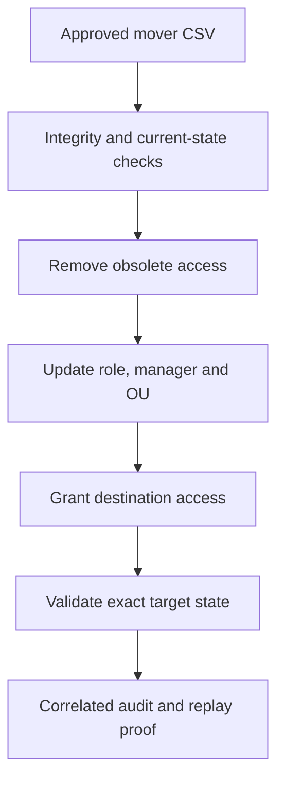

# Controlled Mover Access-Transition Automation

## Purpose

Milestone 5 implements a governed mover process for identities whose role,
department, manager, employment type or access requirements change. The
workflow uses `DC01.corporate.test` as the authoritative directory and limits
all changes to the protected `IAM-Lab` boundary. Microsoft Entra Cloud Sync
remains intentionally disabled until the scoped-synchronization milestone.

| Attribute | Validated value |
|---|---|
| Milestone | 5 — Mover access-transition automation and validation |
| Implementation date | 4 September 2026 |
| Approved mover requests | 3 |
| Cross-department moves | 3 |
| Contractor-to-employee conversions | 1 |
| Obsolete memberships removed | 6 |
| Approved memberships added | 8 |
| Manager changes | 3 |
| Organisational-unit moves | 3 |
| Account expirations cleared | 1 |
| Controlled users after transition | 33 enabled identities |
| Workforce composition | 28 employees and five contractors |
| Direct IAM memberships after transition | 155 |
| Initial audit events | 29 |
| Idempotent replay decisions | 3 no-change results |

## Control flow



The transition removes obsolete access before granting destination access.
This ordering reduces the risk of accumulated privileges and creates an audit
record that distinguishes revocation, identity updates and new grants.

## Pre-change validation

The Milestone 4 foundation was validated before the first mover operation. The
preflight confirmed 33 enabled controlled users, 27 employees, six contractors,
27 manager relationships and 153 direct IAM memberships. It also proved all
three requests matched their recorded source states and that every destination
manager, protected OU and approved Global Security group existed.

The expected transition contained six removals, eight additions, three OU
moves, three manager changes and one account-expiration clear. No directory
write occurred during this validation.


## Approved mover dataset

The authoritative input is
[`iam-project1-mover-requests.csv`](../data/iam-project1-mover-requests.csv).
It contains 30 governance fields and no password, credential, token or secret
column.

| Request | Identity | Source | Destination | Access change |
|---|---|---|---|---:|
| `MVR-2026-0904-001` | Theo Lawson (`IAM2001`) | Information Technology | Operations | 2 removed / 2 added |
| `MVR-2026-0904-002` | Isla Grant (`IAM2002`) | Human Resources | Finance | 2 removed / 2 added |
| `MVR-2026-0904-003` | Mason Cole (`IAM2003`) | Contractor | IT employee | 2 removed / 4 added |

The validated dataset SHA-256 digest is:

```text
AA40213E0C71234FA3F32CF1AF9FA0960EDDA3B231EBEE58D82C5C0A1E23A7C8
```

The laptop source passed schema, uniqueness, approval, date, OU, group and
secret-column checks. The DC01 copy was accepted only after its digest matched
the approved source and the three existing identities matched their declared
source state.


## Transition transaction

[`Invoke-IAMProject1MoverTransition.ps1`](../scripts/Invoke-IAMProject1MoverTransition.ps1)
implements the reusable control sequence:

1. Verify the execution host, domain, input file and exact SHA-256 digest.
2. Require three approved, active and effective mover records.
3. Match one existing identity by Employee ID, `sAMAccountName` and UPN.
4. Confirm each identity is wholly in its approved source or target state.
5. Resolve the enabled target manager, protected destination OU and every
   Global Security group before the first change.
6. Remove memberships present in the source state but absent from the target.
7. Update department, title, employee type, description, manager and OU.
8. Apply or clear account expiration according to the approved target record.
9. Add only missing target memberships and validate the exact final state.
10. Export a correlated audit without passwords or other secrets.

The first execution transitioned all three identities. It removed six obsolete
memberships, added eight destination memberships, changed three managers, moved
three objects and cleared one former contractor expiration. No account was
created, deleted, disabled or assigned a new password.


## Correlated transaction audit

The initial audit is
[`iam-project1-mover-transition-audit.csv`](../data/iam-project1-mover-transition-audit.csv).
All 29 records use correlation ID `M05-MOVER-20260904-200349`.

| Audit action | Events |
|---|---:|
| Preflight validation | 1 |
| Obsolete membership removal | 6 |
| Identity attribute update | 3 |
| Manager change | 3 |
| Organisational-unit move | 3 |
| Account-expiration clear | 1 |
| Approved membership addition | 8 |
| Per-identity target-state validation | 3 |
| Post-transaction validation | 1 |

Its validated SHA-256 digest is:

```text
D83F055148B703AF2DFCF2B41510565DA1937E8CCCD9117EEF1774EF4A07A1EF
```

The audit validator confirmed one correlation ID, valid UTC timestamps, zero
failed or unexpected events, every required workflow stage and correct
removal-before-grant ordering for all three requests. It also found no
secret-bearing field or assignment pattern.


## Least-privilege and worker-type conversion

Mason Cole demonstrates a higher-risk mover scenario: conversion from a
time-bounded contractor to an employee. The workflow removed the contractor
classification and contractor-portal groups before granting employee, IT and
service-desk access. It changed the manager from `IAM1501` to `IAM1201`, moved
the object into the IT Employees OU and cleared the 1 March 2027 account
expiration only because the approved target record required a permanent
employee state.

The final direct membership set is exactly:

- `GG_IAM_All_Workforce`
- `GG_IAM_All_Employees`
- `GG_IAM_Department_InformationTechnology`
- `GG_IAM_Access_M365_Baseline`
- `GG_IAM_Access_IT_ServiceDesk`


An LDAP search in Active Directory Users and Computers confirmed all three
objects carried the expected mover description and remained enabled.


## Comprehensive effective-state validation

The read-only state validator compared each mover with the approved target
record and confirmed zero obsolete, missing or unexpected IAM memberships. It
also validated the original 30 controlled identities, all protected OUs, all
15 Global Security groups, SYNC01 placement, seven required services, Azure
Monitor Agent, the Entra UPN suffix and the preserved SOC and IDTR boundaries.

The final controlled state contains 33 enabled identities: 28 employees and
five contractors, 27 manager assignments and 155 direct IAM memberships. The
leaver OU remains empty and the synthetic high-value group has no members.


## Idempotent replay

The same approved dataset was processed again after the target state was
reached. The automation produced:

- three explicit `IdempotentReplay` / `NoChange` decisions;
- zero membership removals or additions;
- zero attribute, manager, OU or expiration changes;
- zero password changes and zero account deletions; and
- an unchanged final identity and membership count.

The replay audit is
[`iam-project1-mover-idempotent-replay-audit.csv`](../data/iam-project1-mover-idempotent-replay-audit.csv)
with correlation ID `M05-MOVER-20260904-203431` and SHA-256 digest:

```text
73734232695872C9A38B8E3E2AA053A3AA78CC9747FD5A45E2B95D58D9295839
```


## Recovery checkpoint

`DC01` was shut down cleanly before the powered-off VMware snapshot was taken.

| Property | Value |
|---|---|
| Snapshot | `IAM-P1-M05-Controlled-Mover-Automation` |
| Created | 4 September 2026 |
| VM state | Powered off |
| Scope | AD DS after mover transaction, audit and idempotent replay validation |

`SYNC01` received no new snapshot because its guest disk was unchanged during
Milestone 5. Its earlier dedicated-server checkpoint remains applicable until
the Cloud Sync agent installation milestone.


After restart, DC01 returned with the exact target state, all required services,
both audit hashes and every environment-isolation control healthy.


VMware snapshots are laboratory recovery points. They are not a substitute for
AD DS system-state backup, immutable audit storage or production disaster
recovery.

## Security decisions

- Employee ID is the stable lifecycle correlation key.
- The approved source state prevents a stale request from modifying an identity
  that has already changed outside the workflow.
- Obsolete access is removed before destination access is granted.
- Exact replacement avoids privilege accumulation across departments.
- Account expiration is cleared only for the explicitly approved worker-type
  conversion.
- A partial or ambiguous state stops execution for investigation.
- Replay never changes passwords, duplicates identities or repeats grants.
- No privileged or administrative group is available to the mover workflow.
- CSV audits are integrity-checked before publication and contain no secrets.

## Production improvements

- Replace simulated HR CSV files with an authoritative HR or API-driven source.
- Require independent requester, approver and executor identities.
- Execute through a delegated automation identity with only the required OU and
  group permissions, rather than an interactive domain administrator.
- Store immutable audit records centrally and alert on partial transitions.
- Add ticket signatures, effective-time scheduling and segregation-of-duties
  conflict checks.
- Implement transaction-aware compensation approved by an operator instead of
  automatic privilege restoration.
- Use production AD DS backup and tested restore procedures instead of VM
  snapshots.
- Add multiple Cloud Sync agents when production availability requirements
  justify high availability.

## References

- [Automate identity lifecycle management with Microsoft Entra ID Governance](https://learn.microsoft.com/en-us/entra/id-governance/scenarios/automate-identity-lifecycle)
- [Set-ADUser](https://learn.microsoft.com/en-us/powershell/module/activedirectory/set-aduser?view=windowsserver2025-ps)
- [Move-ADObject](https://learn.microsoft.com/en-us/powershell/module/activedirectory/move-adobject?view=windowsserver2025-ps)
- [Remove-ADGroupMember](https://learn.microsoft.com/en-us/powershell/module/activedirectory/remove-adgroupmember?view=windowsserver2025-ps)
- [Add-ADGroupMember](https://learn.microsoft.com/en-us/powershell/module/activedirectory/add-adgroupmember?view=windowsserver2025-ps)
- [Clear-ADAccountExpiration](https://learn.microsoft.com/en-us/powershell/module/activedirectory/clear-adaccountexpiration?view=windowsserver2025-ps)
- [Get-ADUser](https://learn.microsoft.com/en-us/powershell/module/activedirectory/get-aduser?view=windowsserver2025-ps)
- [about Try, Catch and Finally](https://learn.microsoft.com/en-us/powershell/module/microsoft.powershell.core/about/about_try_catch_finally)
