# Integrated Hybrid Identity Lifecycle Validation

## Purpose

Milestone 8 proves that one approved synthetic identity can move through a
complete Joiner, Mover and Leaver lifecycle from Active Directory Domain
Services to Microsoft Entra ID. It validates both the requested changes and
the effective state after Microsoft Entra Cloud Sync processing.

The test identity is `IAM3001`, Nora Whitfield. It exists only for this
laboratory and remains retained in a disabled, access-free state at the end of
the test.

| Attribute | Validated value |
|---|---|
| Milestone | 8 — Integrated Joiner, Mover and Leaver testing |
| Implementation date | 5 September 2026 |
| Authoritative identity source | Active Directory Domain Services on `DC01` |
| Synchronization path | `DC01` → `SYNC01` Cloud Sync agent → Microsoft Entra ID |
| Test identity | `IAM3001` — Nora Whitfield |
| Joiner state | Finance, enabled, five approved groups |
| Mover state | Information Technology, enabled, five approved groups |
| Final Leaver state | Retained, disabled, protected Leavers OU, zero groups |
| Failed lifecycle audit events | 0 |
| Final synchronized users | 35 total; 34 governed IAM users |
| Final synchronized IAM groups | 15 |
| Approved evidence images | 19 |

## Test design

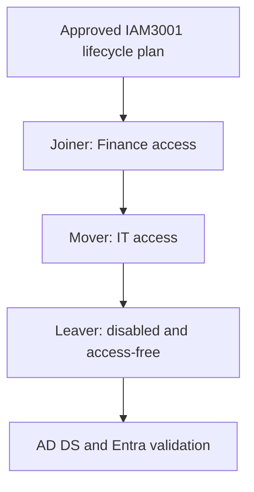

The CSV record defines the exact identity, managers, organisational units,
group memberships and approval identifiers for all three phases. The SHA-256
digest validated during execution was:

```text
9FC4CFF3DB15DB11C7EE05486007953F436BC3FC48124B6275231886CDED9AD3
```

The preflight rejected collisions, missing managers, invalid protected OUs,
unexpected groups, unapproved records and secret-bearing columns before any
directory write.

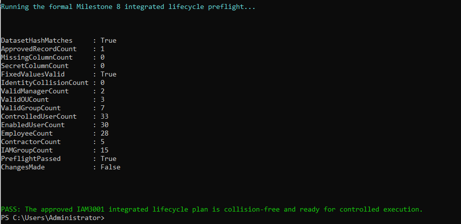

## Trusted pre-test state

The test began only after three independent baselines passed:

- `DC01` retained the validated Milestone 6 state and every required source,
  audit, recovery and validation dependency.
- `SYNC01` remained domain authenticated, time synchronized and connected to
  Microsoft Entra ID with both Cloud Sync services running automatically.
- Microsoft Entra ID contained the expected 33 governed users and 15 IAM
  groups, with no unexpected synchronized objects.

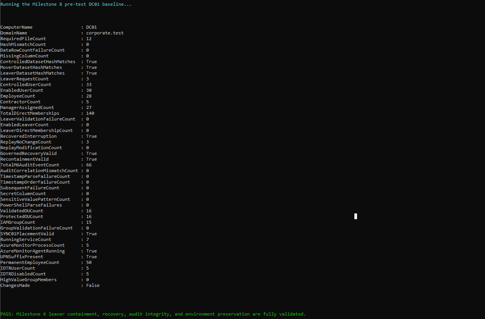

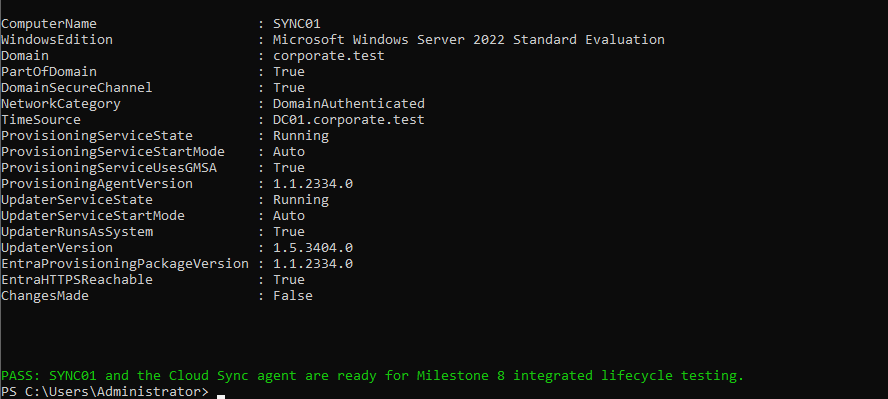

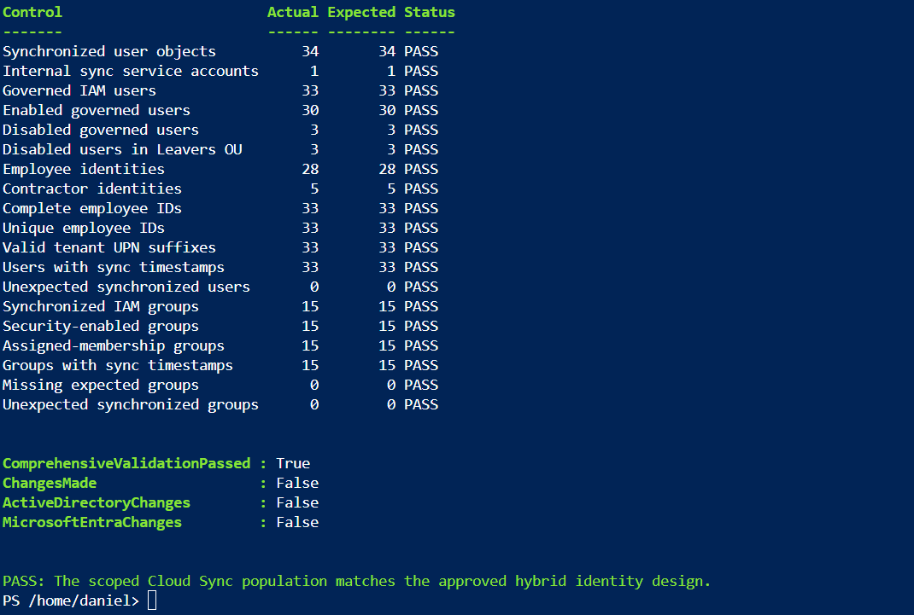

## Joiner validation

The Joiner executor created `IAM3001` in a disabled staging state, assigned the
approved Finance attributes, manager and five direct IAM memberships, and
enabled the account only after governance validation succeeded. The password
was generated in memory and was neither displayed nor exported.

Correlation ID `M08-JOINER-20260905-183407` produced 11 successful audit
events and zero failed events. Independent validation confirmed:

- Finance department and `Financial Systems Analyst` title;
- manager employee ID `IAM1001`;
- placement in the protected Finance employee OU;
- exactly five approved direct IAM memberships; and
- no missing audit columns, sensitive values or ordering failures.

Cloud Sync then created or updated the matching Microsoft Entra identity. The
object was enabled, marked as synchronized from on-premises and held the same
five Windows Server AD sourced groups.

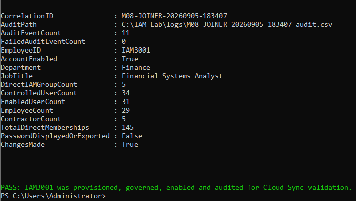

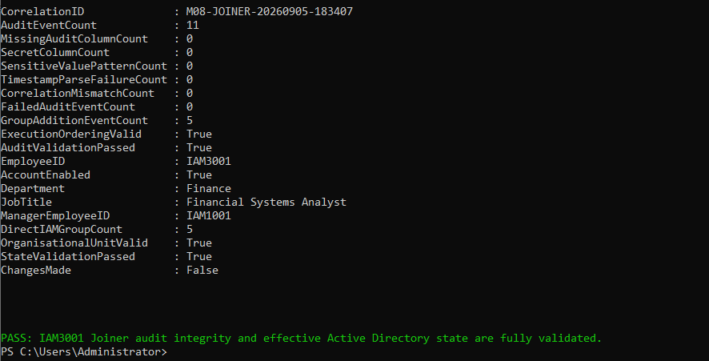

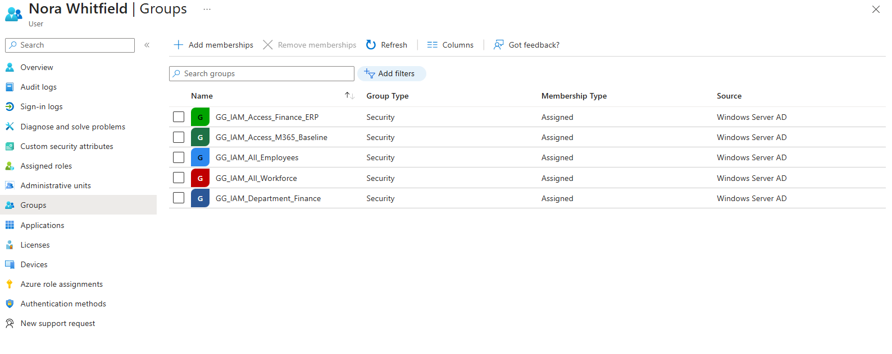

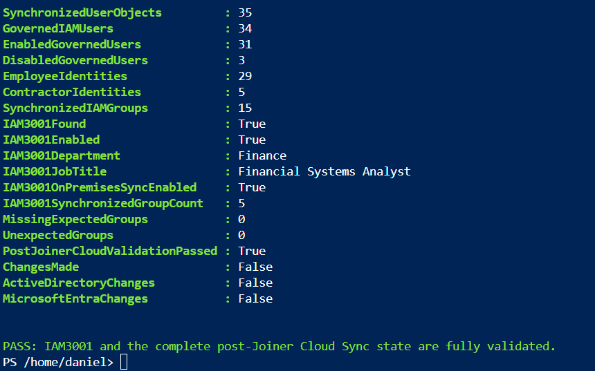

## Mover validation

The Mover executor removed the obsolete Finance ERP and Finance department
memberships before adding the Information Technology department and IT Service
Desk memberships. This sequence avoided temporary access accumulation.

It updated the department, title, manager and protected OU while preserving
the enabled identity and its workforce baseline access. Correlation ID
`M08-MOVER-20260905-205706` produced ten successful audit events and zero
failed events.

Independent AD DS and cloud validation confirmed:

- Information Technology department;
- `Identity Operations Analyst` title;
- manager employee ID `IAM1201`;
- exactly five approved IT-state memberships;
- zero former Finance memberships; and
- a successful Microsoft Entra update with the new attributes and groups.

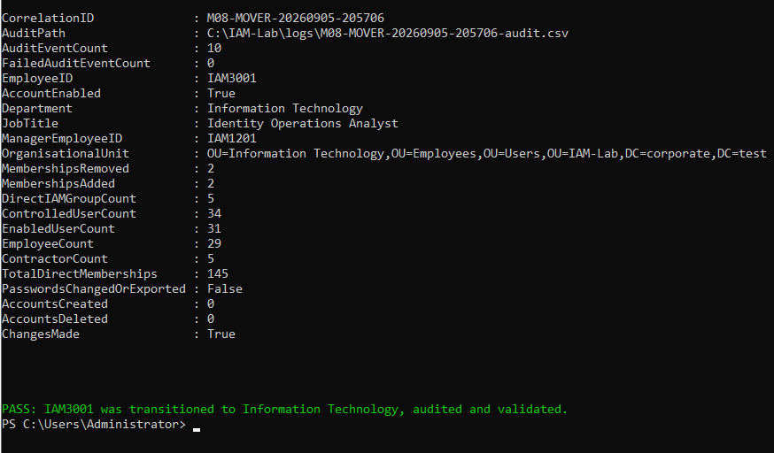

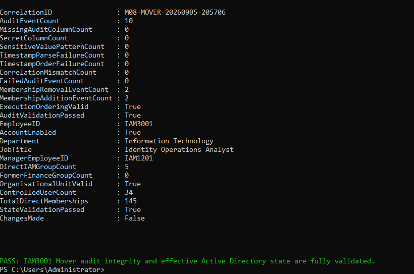

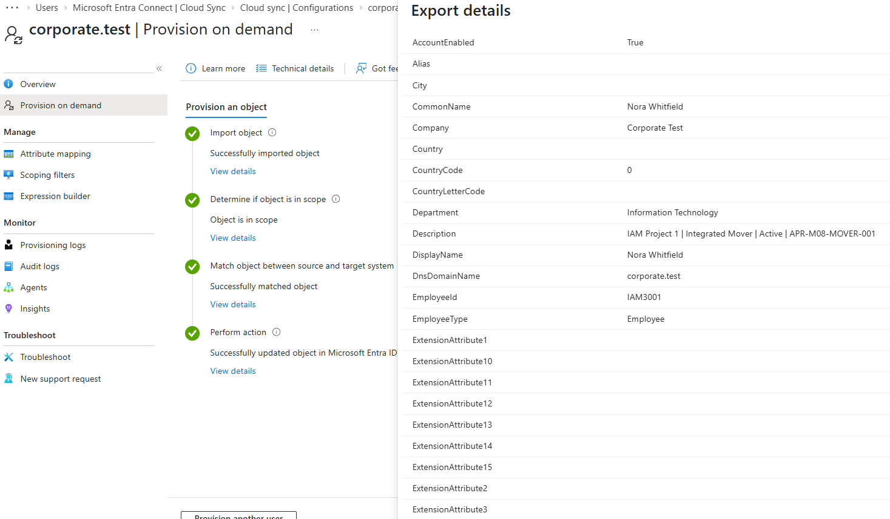

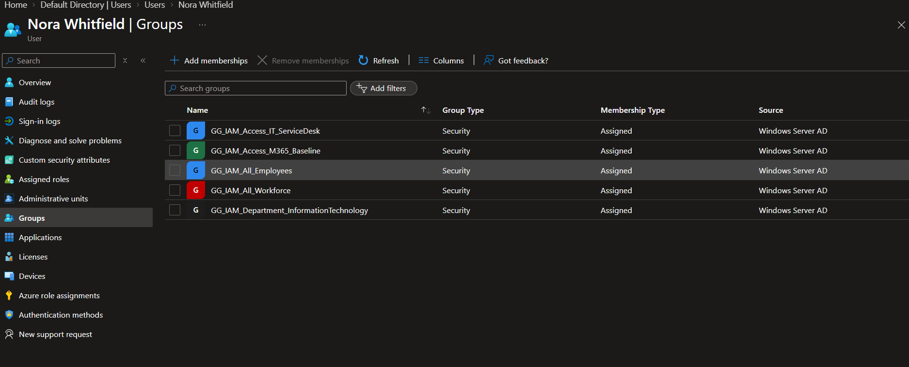

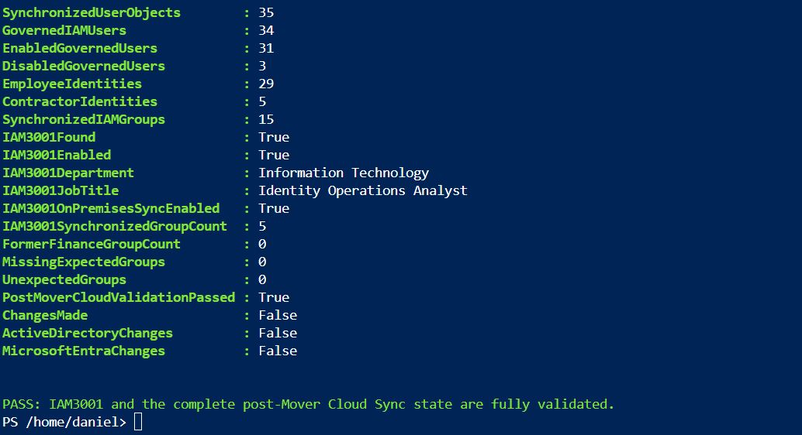

## Leaver validation

The Leaver executor disabled `IAM3001` before removing all five remaining IAM
memberships. It moved the retained identity to the protected Leavers OU and
updated its lifecycle description without deleting the account, changing its
password or erasing the last approved job and manager attributes.

Correlation ID `M08-LEAVER-20260905-215905` produced 11 successful audit
events and zero failed events. Independent validation confirmed:

- account disabled in AD DS and Microsoft Entra ID;
- zero direct or synchronized group memberships;
- retained identity in the protected Leavers OU;
- preserved Information Technology department, Identity Operations Analyst
  title and `IAM1201` manager reference; and
- no audit correlation, timestamp, ordering, sensitive-value or state failures.

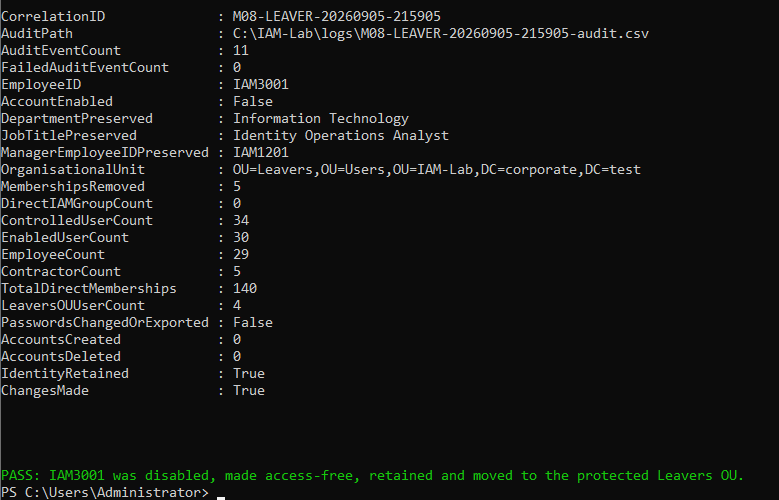

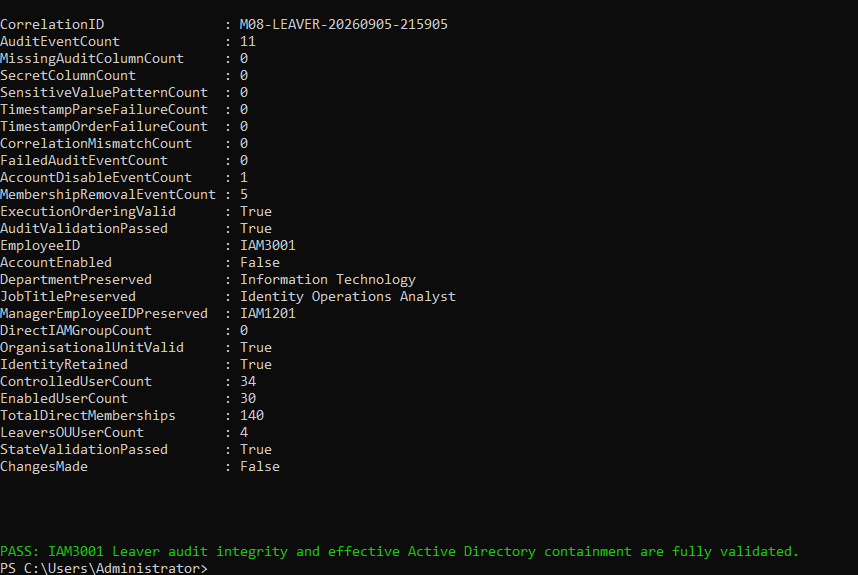

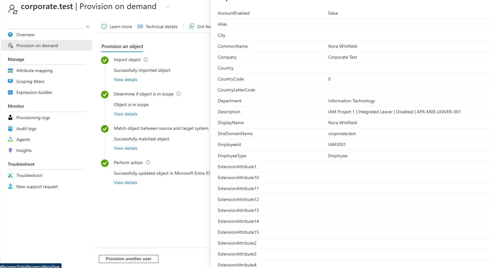

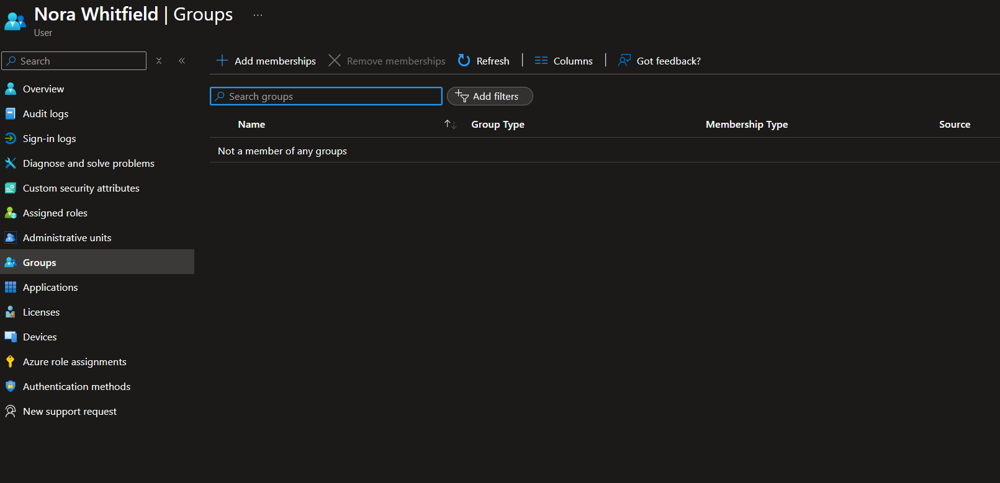

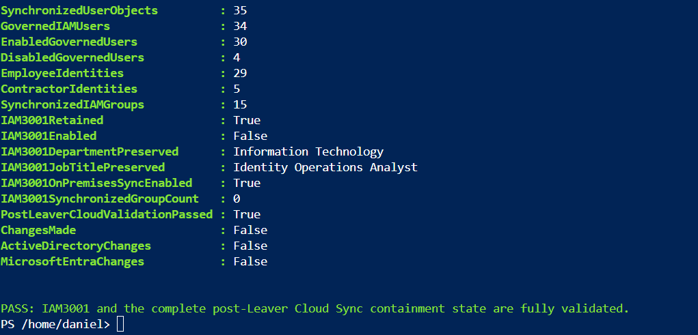

The final consolidated validator reconciled all 32 Joiner, Mover and Leaver
audit events with the retained AD DS identity and the complete governed
population. All three audit files, the IAM3001 final state and the population
baseline passed without making directory changes.

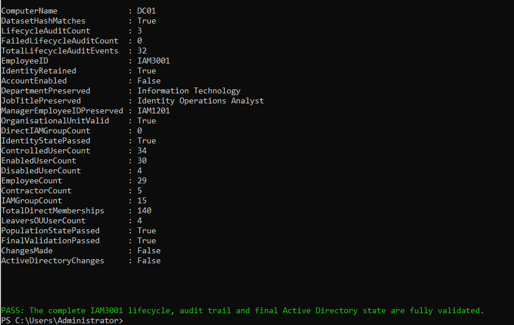

## Final validated state

| Control | Final result |
|---|---:|
| Retained controlled IAM users | 34 |
| Enabled governed users | 30 |
| Disabled governed users | 4 |
| Employee identities | 29 |
| Contractor identities | 5 |
| Direct IAM memberships in AD DS | 140 |
| Synchronized IAM groups | 15 |
| `IAM3001` enabled | False |
| `IAM3001` direct memberships | 0 |
| `IAM3001` synchronized memberships | 0 |
| `IAM3001` on-premises synchronization enabled | True |

The final state demonstrates retention and access revocation rather than
identity deletion. This preserves auditability and supports a governed
recovery decision while preventing the identity from authenticating or
retaining direct IAM access.

## Security and operational controls

- Every change was bound to one approved CSV record and phase-specific
  approval identifier.
- Preflight validation completed before each executor was authorized.
- Obsolete access was removed before replacement access was added.
- Leaver disablement occurred before membership removal.
- Audit records used phase-specific correlation IDs and contained no secrets.
- Executors did not delete accounts or change existing passwords.
- Independent validators performed no AD DS or Microsoft Entra changes.
- Portal evidence was recaptured or sanitized where identifiers added no
  evidential value.

## Limitations and production improvements

This is a controlled single-identity laboratory test. Production deployment
should integrate authoritative HR events, separation of request and approval
duties, privileged access controls, centralized immutable audit retention,
alerting for failed or delayed synchronization, high-availability Cloud Sync
agents and tested AD DS recovery.

On-demand provisioning was used to make phase validation deterministic. Normal
production operations should rely on monitored scheduled synchronization and
use on-demand provisioning primarily for controlled diagnostics.

## References

- [What is Microsoft Entra Cloud Sync?](https://learn.microsoft.com/en-us/entra/identity/hybrid/cloud-sync/what-is-cloud-sync)
- [Configure and run on-demand provisioning](https://learn.microsoft.com/en-us/entra/identity/hybrid/cloud-sync/how-to-on-demand-provision)
- [Microsoft Entra provisioning logs](https://learn.microsoft.com/en-us/entra/identity/monitoring-health/concept-provisioning-logs)
- [Microsoft Graph user resource type](https://learn.microsoft.com/en-us/graph/api/resources/user)
- [List a user's memberships with Microsoft Graph](https://learn.microsoft.com/en-us/graph/api/user-list-memberof)
- [Active Directory module for Windows PowerShell](https://learn.microsoft.com/en-us/powershell/module/activedirectory/)
