# Scoped Microsoft Entra Cloud Sync Deployment and Validation

## Purpose

Milestone 7 connects the protected on-premises `IAM-Lab` identity boundary to
Microsoft Entra ID through Microsoft Entra Cloud Sync. Active Directory Domain
Services on `DC01.corporate.test` remains authoritative, while the provisioning
agent runs on the dedicated `SYNC01.corporate.test` member server.

The deployment intentionally synchronizes only the 33 governed IAM users and
15 `GG_IAM_*` security groups. The 50 permanent SOC users and five disabled
identity-threat-detection users remain outside the Cloud Sync scope.

| Attribute | Validated value |
|---|---|
| Milestone | 7 — Scoped Microsoft Entra synchronization and cloud-state validation |
| Implementation date | 5 September 2026 |
| Synchronization technology | Microsoft Entra Cloud Sync |
| Provisioning-agent host | `SYNC01.corporate.test` |
| Authoritative source | Active Directory Domain Services on `DC01` |
| Governed users synchronized | 33 |
| Enabled governed users | 30 |
| Disabled governed users | 3 retained leavers |
| Synchronized IAM groups | 15 Global Security groups |
| Password hash synchronization | Enabled |
| Provisioning failures at final review | 0 |
| Unexpected synchronized users | 0 |
| Unexpected synchronized groups | 0 |

## Synchronization boundary

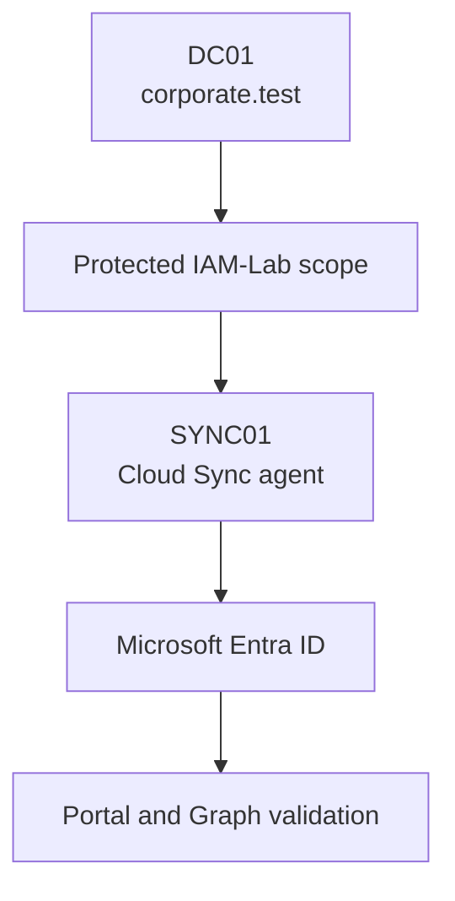

The configuration includes the governed user branches, the retained Leavers
OU and the IAM group branch beneath `OU=IAM-Lab,DC=corporate,DC=test`. Objects
outside that protected hierarchy are not included. This preserves the earlier
SOC and identity-threat-detection environments and prevents accidental
whole-directory synchronization.

The Cloud Sync configuration was created only after the portal showed an empty
configuration baseline and the local agent validation had passed.

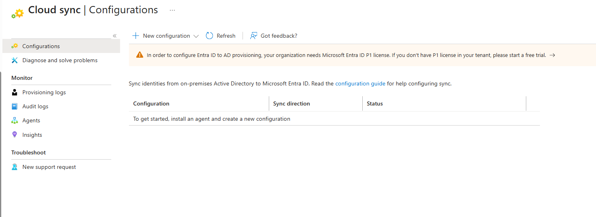

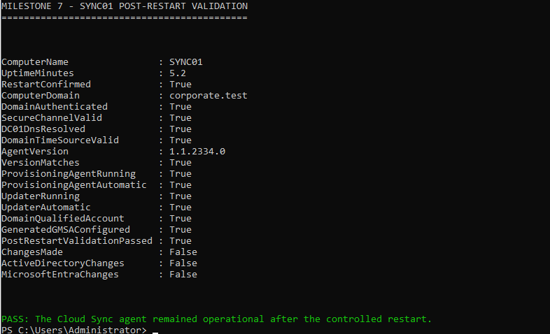

## Controlled rollout

The deployment used a pilot-first sequence:

1. Register the provisioning agent on the dedicated `SYNC01` server.
2. Create the Cloud Sync configuration for `corporate.test`.
3. Restrict scope to the approved organisational units.
4. Review attribute mappings and enable password hash synchronization.
5. Use on-demand provisioning for the synthetic pilot identity Ava Mitchell.
6. Start the configuration only after the pilot succeeded.
7. Validate health, provisioning activity, failures, users and groups.

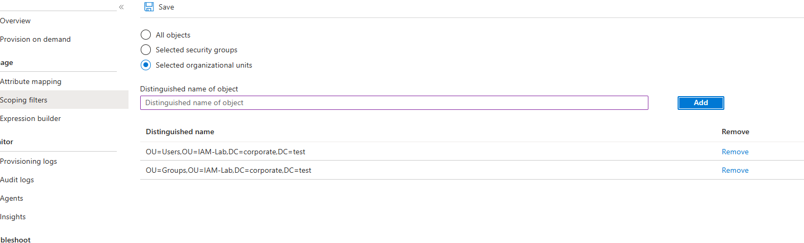

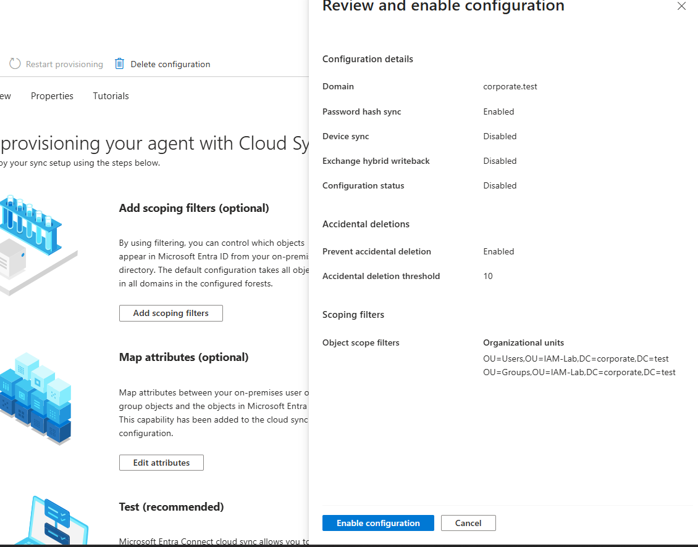

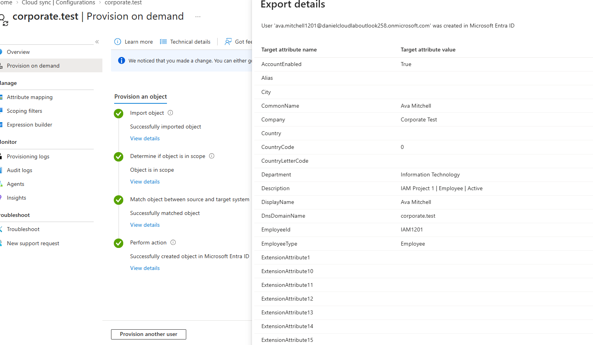

The pilot reduced the blast radius of mapping or scope errors before the full
governed population was synchronized. It did not replace final population and
failure validation.

## Effective cloud state

After the configuration entered a healthy state, provisioning logs showed
updates flowing from Active Directory to Microsoft Entra ID. A separate
failure-only view for the final 24-hour review returned no results.

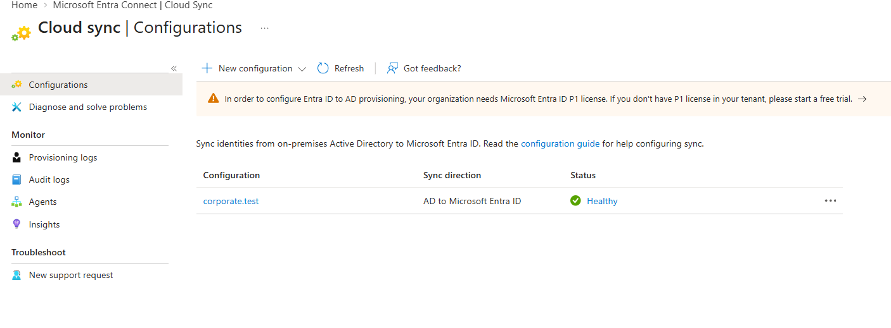

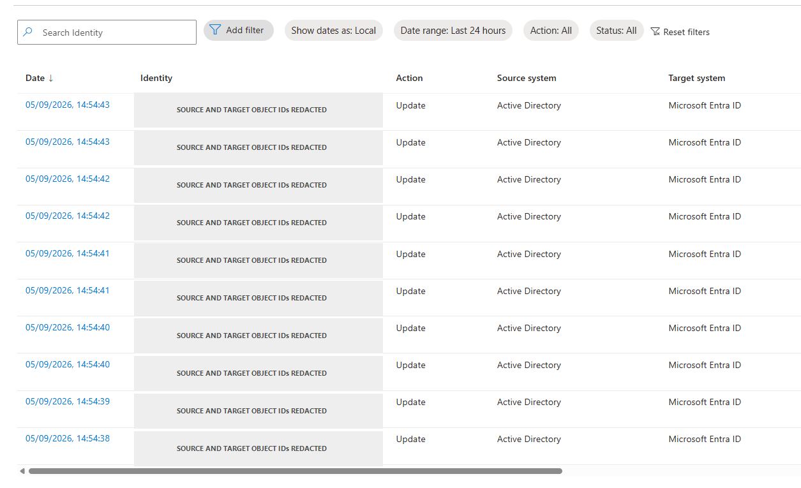

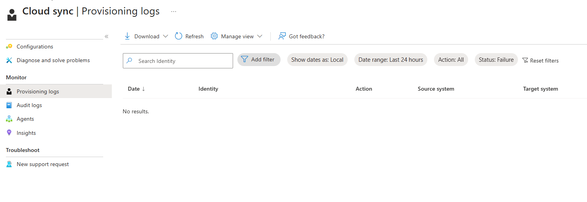

Microsoft Entra ID contained exactly 33 synchronized objects tagged with the
`Corporate Test` company value. These represent 28 employees and five
contractors. Thirty accounts remained enabled, and the three approved leavers
remained present but disabled.

The 15 synchronized `GG_IAM_*` objects remained security-enabled groups with
assigned membership. Cloud Sync did not convert them to Microsoft 365 groups
or dynamic-membership groups.

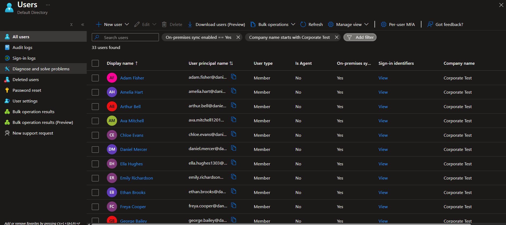

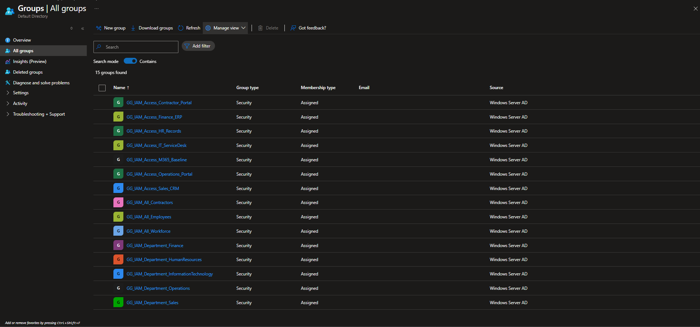

## Comprehensive validation

[`Test-IAMProject1CloudSyncState.ps1`](../scripts/Test-IAMProject1CloudSyncState.ps1)
performs a read-only Microsoft Graph validation from Azure Cloud Shell. It
checks the approved population rather than treating a healthy portal status as
sufficient proof.

The validated controls were:

- 34 synchronized user objects in total: 33 governed IAM users and one
  internal synchronization service account.
- Exactly 33 governed identities with company name `Corporate Test`.
- Exactly 30 enabled and three disabled governed identities.
- All three disabled identities retained from the protected Leavers OU.
- Exactly 28 employee and five contractor identities.
- Complete and unique `IAM*` employee IDs for all governed identities.
- Valid tenant UPN suffixes and non-null synchronization timestamps.
- Exactly 15 expected `GG_IAM_*` groups and no unexpected IAM groups.
- All 15 groups security-enabled, assigned-membership objects with
  synchronization timestamps.

The script reports `ChangesMade : False`, `ActiveDirectoryChanges : False` and
`MicrosoftEntraChanges : False`. It reads Microsoft Graph state and does not
modify either directory.

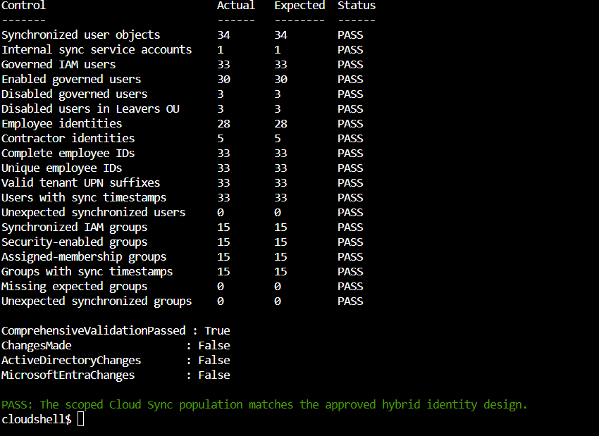

## Security and operational controls

- `SYNC01` remains separate from the domain-controller role and is treated as
  an identity control-plane asset.
- The configuration uses an explicit OU boundary instead of synchronizing the
  whole `corporate.test` directory.
- Passwords, access tokens, tenant secrets and reusable credentials are not
  stored in the repository.
- Disabled leaver accounts remain disabled after synchronization.
- Portal health, successful activity, a zero-failure query and direct object
  state are all validated independently.
- Object identifiers exposed during troubleshooting were removed from public
  screenshots when they added no evidential value.

## Limitations and production improvements

This laboratory uses one Cloud Sync agent. A production deployment should use
additional active agents when availability requirements justify them, apply
formal privileged administration and monitoring controls, and integrate change
approval and alerting with enterprise operations.

The project does not implement device synchronization, Hybrid Microsoft Entra
Join, pass-through authentication, federation or Exchange hybrid. Those
capabilities were not required by the approved design and must not be inferred
from this implementation.

## References

- [What is Microsoft Entra Cloud Sync?](https://learn.microsoft.com/en-us/entra/identity/hybrid/cloud-sync/what-is-cloud-sync)
- [Microsoft Entra Cloud Sync prerequisites](https://learn.microsoft.com/en-us/entra/identity/hybrid/cloud-sync/how-to-prerequisites)
- [Install the Microsoft Entra provisioning agent](https://learn.microsoft.com/en-us/entra/identity/hybrid/cloud-sync/how-to-install)
- [Configure and run on-demand provisioning](https://learn.microsoft.com/en-us/entra/identity/hybrid/cloud-sync/how-to-on-demand-provision)
- [Troubleshoot Microsoft Entra Cloud Sync](https://learn.microsoft.com/en-us/entra/identity/hybrid/cloud-sync/how-to-troubleshoot)
- [List users with Microsoft Graph](https://learn.microsoft.com/en-us/graph/api/user-list)
- [List groups with Microsoft Graph](https://learn.microsoft.com/en-us/graph/api/group-list)
